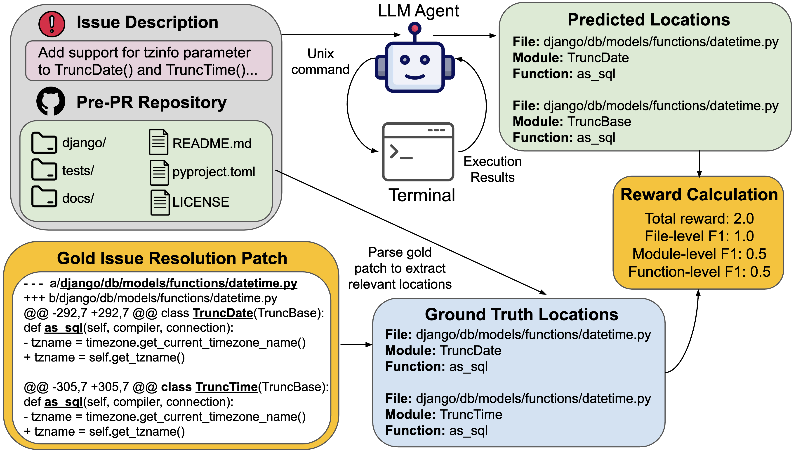

<div align="center">
  

  <h1>CodePin</h1>

  <p><strong>Pin the right code before you write the code.</strong></p>
  <p>面向大型仓库的专用 Code Locator 子 Agent，通过 Agentic RL 后训练，为主 Coding Agent 提供文件、类与函数级精准上下文。</p>

  <p>
    <a href="https://github.com/PeterLeeXX/CodePin/stargazers"></a>
    <a href="https://github.com/PeterLeeXX/CodePin/forks"></a>
    <a href="https://github.com/PeterLeeXX/CodePin/blob/main/LICENSE"></a>
    
    
  </p>
</div>

## Why CodePin?

主 Coding Agent 在大型仓库中常常把大量 Token 花在“找代码”上：文件定位不准、长轨迹中的上下文逐渐腐烂、无关代码不断挤占上下文窗口。CodePin 把定位能力拆成一个专用子 Agent，让主 Agent 在开始分析和修改前，先拿到紧凑、可验证的相关代码坐标。

```text
Issue / Task
    ↓
CodePin Locator ── 搜索、执行、验证 ──→ 文件 / 类 / 函数级上下文
    ↓
Main Coding Agent ── 聚焦推理与修改 ──→ Patch
```

## What it does

- **多粒度定位**：同时预测相关文件、类 / 模块与函数，而不止返回宽泛的文件列表。
- **Agentic search**：通过多轮工具调用主动探索仓库，并以专用 finish tool 输出结构化定位结果。
- **RL post-training**：从真实 issue 与 gold patch 中提取监督信号，以多层级 localization F1 作为奖励进行后训练。
- **上下文压缩**：将精确代码坐标交给主 Agent，减少无关上下文、重复搜索与 Token 消耗。
- **训练栈**：基于 SkyRL、vLLM、Ray 与 GRPO / GSPO 的 Qwen3.5 多 GPU 训练链路。

<p align="center">
  
</p>

## Quick start

> 当前版本面向研究与训练，建议在 Linux + NVIDIA GPU 环境中运行。

```bash
# Required system search backend
sudo apt-get update && sudo apt-get install -y ripgrep

# Install the tested Qwen3.5 / SkyRL v0.3 stack
uv sync

# Verify CUDA, hybrid-attention kernels and Qwen3.5 registration
uv run python scripts/preflight_qwen3_5.py

# Build code-search train / validation data from the raw SWE-Smith shards.
# The builder resolves patch lines to file, class/module, and function targets.
uv run python -m src.build_swe_smith_code_search \
  --input data/orgin_SWE_smith \
  --output data/SWE-smith-code-search \
  --overwrite

# Use repeated 14B rollouts only as a difficulty signal. The resulting
# easy/medium/hard parquets retain the real source-data schema and do not copy
# rollout conversations into the trainable data.
uv run python scripts/split_rollout_difficulty.py \
  --rollouts train-14B-rollout.parquet \
  --source data/SWE-smith-code-search/train.parquet \
  --output data/SWE-smith-code-search-difficulty

# Select a deterministic first-round pool for teacher response generation:
# 60% representative, 25% boundary, and 15% long-tail samples.
uv run python scripts/select_sft_candidates.py \
  --source data/SWE-smith-code-search/train.parquet \
  --difficulty-index data/SWE-smith-code-search-difficulty/difficulty_index.parquet \
  --output data/SWE-smith-code-search-sft-selection-6000 \
  --size 6000

# Generate resumable, repository-grounded teacher trajectories. The API key is
# read only from the named environment variable and is never stored in outputs.
export DASHSCOPE_API_KEY="..."
uv run python scripts/generate_teacher_trajectories.py \
  --input data/SWE-smith-code-search-sft-selection-6000/teacher_generation.parquet \
  --selection-index data/SWE-smith-code-search-sft-selection-6000/selection_index.parquet \
  --output data/SWE-smith-code-search-teacher-qwen3.5-35b-a3b

# Build SFT data from successful teacher trajectories
# Only the canonical glob/grep/read_file/localization_finish schema is accepted.
uv run python scripts/prepare_sft_data.py \
  --trajectories data/SWE-smith-code-search-teacher-qwen3.5-35b-a3b/trajectories \
  --output data/sft-code-search

# Full-parameter SFT: Qwen3.5-0.8B, one epoch, all assistant turns
bash scripts/run_sft_qwen3_5_0_8b.sh

# Continue with on-policy GRPO/GSPO from the exported SFT checkpoint
MODEL=/absolute/path/to/sft/hf_export \
  bash scripts/run_rl_qwen3_5_0_8b.sh
```

清洗脚本会过滤空问题描述、没有 Python 修改以及创建/删除文件的任务，忽略非 Python 修改，并根据 mutation patch 的逆向修复语义生成 `file_changes`、`target`、`prompt` 和 `use_patch`。输出包含 `train.parquet`、`validation.parquet` 与记录逐类过滤数量的 `cleaning_report.json`；下载的源码缓存在 `data/.cache/swe_smith_sources`，后续运行可直接复用。

如果已经有处理好的 Hugging Face 数据集，也可以继续使用 `python -m src.build_dataset` 进行下游字段转换和 train/validation 切分。

训练参数、奖励组合和 Prompt 模板分别位于 [`configs/`](configs/)、[`src/rewards/`](src/rewards/) 与 [`src/prompts/templates/`](src/prompts/templates/)。

Qwen3.5 的 AutoDL 环境、显存缩放与 SFT → RL 顺序见 [`docs/AUTODL_QWEN35.md`](docs/AUTODL_QWEN35.md)。

## Released artifacts

- [CodePin-SFT-Qwen3.5-0.8B](https://huggingface.co/LeeXugar/CodePin-SFT-Qwen3.5-0.8B)
- [CodePin-SFT-Qwen3.5-35B-A3B](https://huggingface.co/datasets/LeeXugar/CodePin-SFT-Qwen3.5-35B-A3B)
- [CodePin Hugging Face Collection](https://huggingface.co/collections/LeeXugar/codepin-6a8afa1064d9f83f9fce2982)

## Roadmap

- [x] 文件、类与函数级联合奖励
- [x] 多轮工具调用与 Agentic RL 训练
- [x] 发布 SFT 训练数据与模型权重
- [ ] 发布标准代码定位评测结果
- [ ] 提供可直接接入主 Coding Agent 的轻量推理服务
- [ ] 扩展更多语言与超大型 monorepo 场景

## License

CodePin 基于 [MIT License](LICENSE) 开源。
