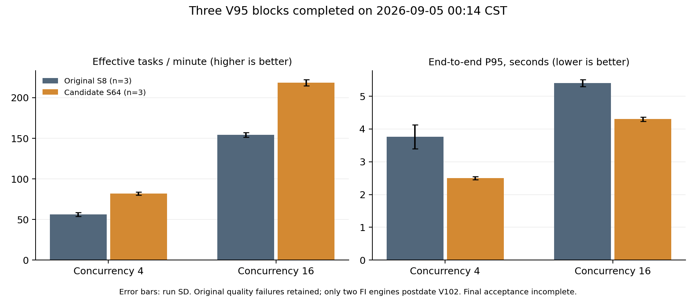

# CodePin 性能验收进展（2026-09-05）

本记录承接 [完整阶段调优报告](https://github.com/PeterLeeXX/CodePin/blob/b73eb0299a9b54a02964c440647a4391e4d8f5fb/docs/VLLM_TUNING_REPORT_20260904.md)，保留所有旧结果和质量失败。此处是新增证据，**最终性能配置、稳定容量和本机 Codex MCP 使用验收尚未完成**。

## 三次独立引擎对照已经收齐

V95 于 2026-09-05 00:14:37（UTC+8）结束。完成 24 组真实 MCP 端到端测量、37,565 次任务、173,784 次模型请求，以及 3 次固定真实轨迹回放。全部组无基础设施异常或超时，原生请求数逐组等于真实轨迹轮数，失败定位任务仍保留。

S64/FI/G1024/B8192/APC-align 候选与原部署使用相同任务、预算、种子和计时规则；完整定位结果缓存关闭。每项三次引擎重复，预热 30 秒、正式运行 180 秒，稳态取 `[60,180)`；冷前缀验证单列全程计时。表中的区间是运行均值的 95% t 区间半宽，P50/P95 为三次分位数的均值。

| 条件 | 有效 tasks/min，均值±95% CI 半宽 | P50 / P95 秒 | 原 V86 三次检查 |
|---|---:|---:|---|
| FI 调参 P1/C4 | 82.17±4.70 | 1.512 / 2.498 | 通过 |
| FI 调参 P4/C16 | 218.50±8.96 | 2.246 / 4.301 | 失败，保留三组上下文成本差异 |
| FI 调参 P32/C64 | 459.67±22.23 | 3.345 / 8.546 | 一组失败、两组通过 |
| FI 验证 P4/C16 | 182.00±5.69 | 1.554 / 3.654 | 通过 |
| FI 验证 P32/C64 | 408.50±14.32 | 2.669 / 6.945 | 通过 |
| FA2 调参 P1/C4 | 84.50±3.73 | 1.487 / 2.466 | 通过 |
| FA2 调参 P32/C64 | 467.83±33.36 | 3.283 / 8.414 | 通过 |

FI 冷前缀验证 C4 的全程有效吞吐为 55.22±1.91，P95 为 2.366 秒。三次固定轨迹回放为 168.441、170.619、171.525 tasks/min；回放不代替真实定位吞吐。

与原部署三次均值比较，FI 调参 C4 的有效吞吐 +45.86%、P95 −33.66%；C16 的有效吞吐 +41.73%、P95 −20.37%。这些是三次均值的描述性变化，不能越过质量和稳态验收。C64 比原 C16 的容量更高但 P95 也更高，不能混写为同负载提速。

相同 S64/G1024 与工具链下，FA2 在现有 C4/C64 对照的均值略高于 FI，运行区间重叠。早期 S256 的 FI 收益不足以预先决定 S64 的生产后端；因此增加 V118，对 FA2 尚缺的调参 C16、冷前缀验证 C4、验证 C16/C64 各做三次独立引擎测量。V95 已完成的 FA2 C4/C64 不重复充数。

### 同负载服务指标的三轮补充

P4/C16 的三次原部署与 FI/S64 组合对照如下。引擎时间是完整测量区间的单请求均值；资源值来自 `[60,180)` 稳态样本。每行都是三次运行均值，不能把并行请求的阶段时间相加成任务关键路径。

| 指标 | 原 S8 | FI/S64 组合 |
|---|---:|---:|
| 模型请求平均排队 | 189.677 ms | 0.021 ms |
| 模型请求平均首 token | 242.221 ms | 58.981 ms |
| 模型请求平均 prefill | 30.834 ms | 36.297 ms |
| 模型请求平均 decode | 296.247 ms | 327.030 ms |
| 平均输出 token 间隔 | 5.209 ms | 5.737 ms |
| 生成 tokens/s | 1398.86 | 1988.06 |
| 原生前缀命中率 | 91.254% | 91.283% |
| 平均 GPU 利用率 | 59.61% | 63.30% |
| 平均 GPU 已用内存 | 59.468 GiB | 59.492 GiB |
| 平均主机匿名内存 | 5.569 GiB | 5.757 GiB |
| 引擎 CPU 核当量 | 1.027 | 1.026 |
| 平均引擎等待请求数 | 5.195 | 0 |

任务有效吞吐提高并不意味着每次 GPU 推理都更快：本对照中排队明显减少，单请求 prefill/decode 略慢，前缀命中率近似相同。二者原本都启用 APC，不能把启用 APC 作为本次组合增益。源码和服务参数同时变化，以上只是同负载观察；V100 的原服务参数对照仍需完成后才能进一步归因。原部署没有新增 Agent 阶段埋点，因此不补造哈希/初始化的三轮前后阶段值。

计算输入为本地已校验材料，复现 `python tmp/service-attribution-v126.py`；输出 [service-attribution.json](assets/performance/20260905-service-attribution.json)，保留两组源文件摘要和各指标的运行间统计量。

## 质量检查与证据边界

24 组均重新从完整记录执行 V86，结果与原运行时报告完全一致。四组旧失败均保留；采用已冻结 V102 分析规则后，24 组没有新增退化标记，所有结果数、原始均值、有效任务判定与工具成本保持不变。V102 仅单列符合其条件的定位改善伴随上下文成本增加，细节见 [阶段七说明](PERFORMANCE_TUNING_20260904.md)。

V102 冻结时间为 2026-09-04 22:42:10。FI 的 r2/r3 引擎都在该时间之后启动，r1 在之前；因此当前只有两次符合新规则的前瞻重复，不能把 r1 追认成第三次。V104 已排队补齐独立引擎。FA2 现有对照使用原 V86 就通过，不借用新规则改写历史结果。

37,565 次任务仍只覆盖原调参和验证集合。七个新仓库任务没有用于本轮调参，须在配置确定后完成最终独立验证。

## 剩余远程验收

| 验收项 | 当前状态及通过所需证据 |
|---|---|
| 三次固定原部署基线 | 已完成；18 组 E2E、3 次回放及全部失败记录 |
| 三次 S64 组合与后端对照 | V95 数据收齐；V102 所需第三次前瞻引擎待 V104 |
| 仅代码优化、原 vLLM 参数不变 | V100 已排队，六种基线条件各三次，分离 Agent 侧与服务侧贡献 |
| 更大原生容量 | V98 运行中；筛选后对合格且更优的候选补齐重复和邻域，不预设 S64 是上限 |
| FA2 缺失负载 | V118 已登记串行队列，新增 12 组，沿用 V95 的原始 server/measure 函数 |
| 并发及到达率边界 | 对通过质量门槛的配置扫描，保留拒绝、超时和失败，验证平台与尾延迟变化 |
| 至少 15 分钟稳态 | 在最终候选完成，不用短峰值替代；检查队列、内存、吞吐及 P95 趋势 |
| 七项独立任务 | 参数冻结后运行，保留全部失败及标签，不用于再次调参 |
| 最终 Nsight / 缓存 / 功能回归 | 使用最终配置，采集与正式计时分开，核验原生缓存事件、真实 token 前缀、MCP 和 SkyRL |
| 本机 Codex 真实 MCP 调用 | 用户新增验收：真实服务注册到本机 Codex，由 Codex 通过注册工具完成一次实际代码定位，并保留调用和结构化结果证据 |

新增 Codex 集成安排在性能验收之后、云主机关机之前。配置文件存在、工具枚举成功或独立 MCP 测试通过，都不能单独替代 Codex 实际发起的工具调用。

用户进一步明确：链路跑通后关闭云主机。执行顺序为完成远程验收、实际 Codex MCP 调用、材料拉回与校验、阶段提交，然后关机；关机后远程模型和 MCP 不再提供服务。接入步骤已补入 [服务说明](SERVING_AND_EVALUATION.md#注册到本机-codex)，实际注册和调用仍待执行。

## 原始材料与复现

完整 V95 材料已拉回 `E:\Desktop\CodePin\tmp\verification\20260904-vllm-performance\complete-comparison-material-v117\`。492 个归档条目逐件核验，零失败；压缩包 22,791,348 bytes，SHA-256 `af9e473b776845f30427dc3052b0292bec691e8b7c80bcad304f66eb70ff0a2d`。归档在正式测量之间执行，开始、结束均未发现正式 benchmark 进程。

可审查摘要见 [stage8-evidence.json](assets/performance/20260905-stage8-evidence.json)。完整重分析位于本地材料的 `complete-comparison-analysis-v119/evidence.json`，由本地 `python -m tmp.analyze-complete-comparison-v119` 实际执行；它逐组核验原始摘要、原生请求数、参考文件和新旧判定，不发起模型请求。图中误差棒为 SD，与表中的 95% CI 分开标注。

本次推送只更新调优分支的进展材料。已推送 main 的 `b73eb02` 及云端 V95 固定源码不因这一阶段报告改变；未切换最终部署配置、未启动训练、未关机。
