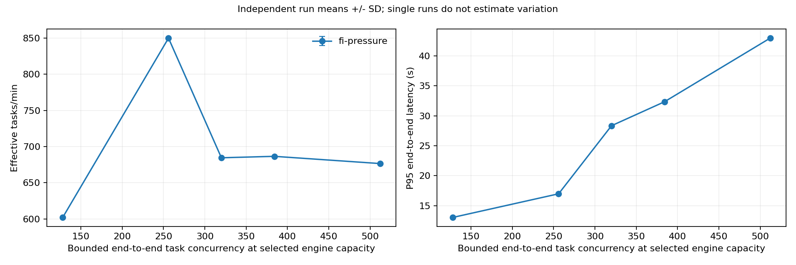
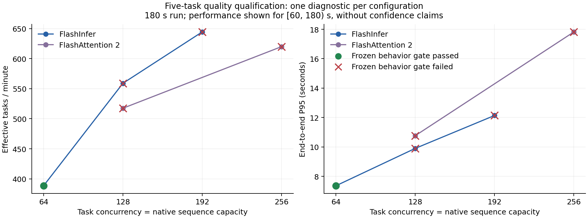
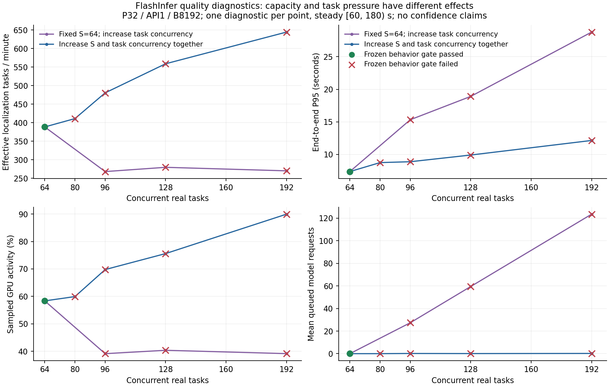
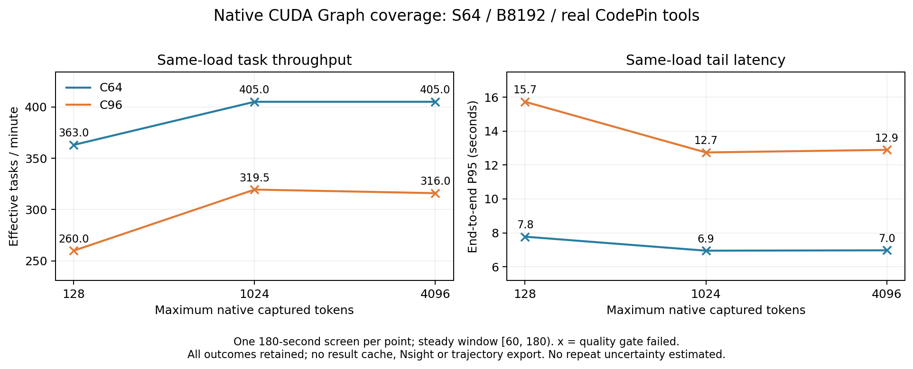
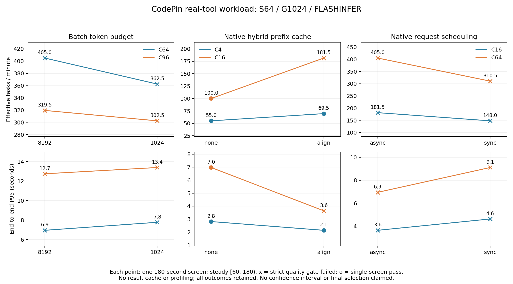
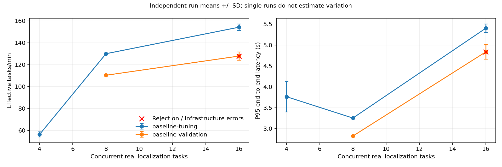
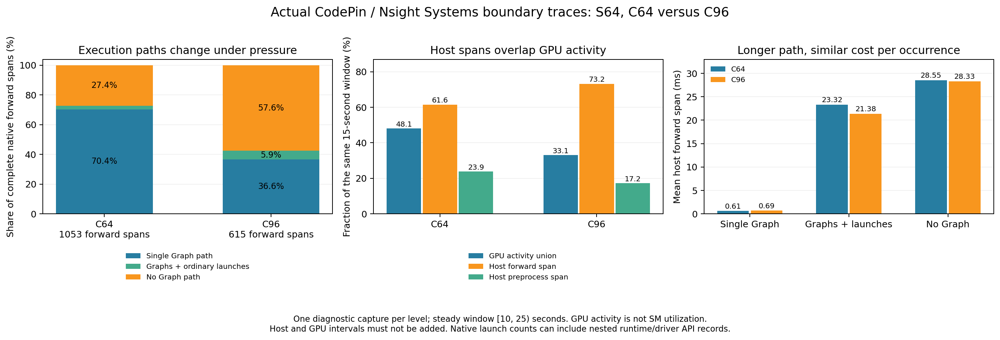
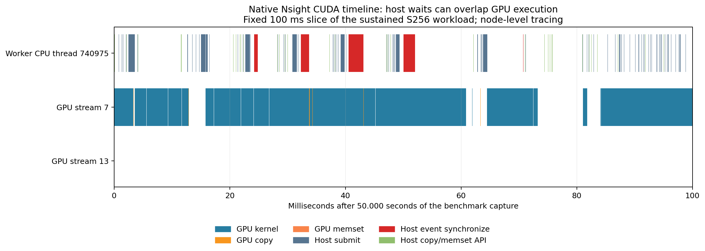
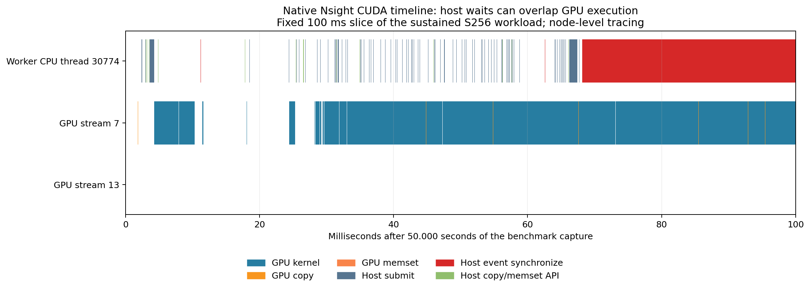

# CodePin 真实定位工作负载性能实验（2026-09-04）

本实验使用现有 CodePin-SFT-Qwen3.5-0.8B、SkyRL 0.3.0 和 vLLM 0.23.0，不训练、不修改权重。实验记录目录为 `runs/20260904-vllm-agent-performance/`。基线来自提交 `9e56b610e9e366a22744751dc5ff70052e826c8d`。2026-09-03 的三任务验收只作为功能依据，本次重新测量性能。

## 阶段交付状态

这是阶段报告，尚未完成最终性能验收。当前提交包含真实 MCP 端到端基准、固定轨迹回放、资源与前缀统计、Nsight 分析、可关闭埋点，以及仓库摘要和并发工具初始化改动。Linux 环境的 74 项非集成测试全部通过（39.911 秒，零失败、错误或跳过）；提交前核验 52 个 Python/环境声明文件与远端已测量文件一致，按 LF 规范化后逐件比较 SHA-256。测试报告及来源摘要见实验材料的 `results/pre-confirmation-unit-v31/tests.xml`、`configs/phase-source-manifest-v48.json`。

已获得可重复执行的基准与实际 Nsight 证据，但三次独立正式对照、最终配置的 15 分钟稳态、新冻结任务集和完整真实模型回归尚待完成。下列单次筛选不得视作最终提升或饱和结论；高吞吐但行为退化的配置仍记为失败。阶段指标及原始文件摘要随仓库提供在 [stage1-evidence.json](assets/performance/20260904-stage1-evidence.json)。

第二阶段完成了五项压力筛选、七项新任务的实际仓库准备，以及 token 来源和 NVTX 系统依赖核验，见 [stage2-evidence.json](assets/performance/20260904-stage2-evidence.json)。运行代码仍是阶段提交 `97ada3bae907b381ab88d20f1b0506c836ad48fb`；本阶段不改变推理实现或质量门槛。

第三阶段完成三项质量邻域测试，以及 S64/C64、S64/C96 各一组 Nsight/无采集对照，见 [stage3-evidence.json](assets/performance/20260904-stage3-evidence.json)。两份新原始 trace、SQLite、八份 CSV 统计和逐任务记录已拉回本地，2,158 个条目全部校验通过；本地目录为 `tmp/verification/20260904-vllm-performance/stage3-material-v60/`。压缩包为 435269860 bytes，SHA-256 `2834ac25d1d3a821db5c98ca9c2165fc46fd61936f504e347919b085ef87392c`。随后根据该证据完成原生图捕获范围对照，结果见阶段四；尚未采用新的默认配置。

第四阶段完成六组原生 CUDA Graph 范围对照，保留 15,805 次真实任务执行与 69,642 次模型请求，见 [stage4-evidence.json](assets/performance/20260904-stage4-evidence.json)。全部请求数与实际轨迹轮数相符，无基础设施异常或超时，但六组均有逐任务质量或工具行为退化，未采用为默认配置。155 个原始材料条目已拉回并逐件校验；后续批量预算、缓存与调度对照见阶段五。

第五阶段完成八组原生批量、缓存和同步调度对照，保留 11,650 次真实任务与 51,321 次模型请求，见 [stage5-evidence.json](assets/performance/20260904-stage5-evidence.json)。所有请求数与实际轮次相符，基础设施异常和超时均为零；三组低负载配置通过单次严格筛选，其他五组失败。234 个原始条目已拉回并核验，另以五条真实轨迹核对了 22 轮原生贪心采样与 token 追加。完整三次原部署基线已在阶段六补齐；最终配置、饱和及最终验收仍待完成。

## 硬件、软件与模型身份

| 项目 | 本次实测 |
| --- | --- |
| GPU | NVIDIA RTX 6000D，85,651 MiB，计算能力 12.0，功率上限 600 W |
| 驱动 / 系统 | 595.71.05 / Ubuntu 22.04.5，Linux 5.15.0-78 |
| CPU | Xeon Platinum 8470Q；可见 208 逻辑核，容器配额 **22 核** |
| 主机内存 | 容器上限 118,111,600,640 bytes（110 GiB），无 swap；宿主机总量不是可用配额 |
| 存储 | `/root/autodl-tmp` 为 XFS / RAID5 非旋转设备，配额 53,687,091,200 bytes（50 GiB）；初始约 13 GiB 空闲 |
| Python / Torch | 3.12.14 / 2.11.0+cu128 |
| vLLM / Transformers | 0.23.0+cu129 / 5.8.0 |
| SkyRL | 0.3.0，`f5bc3b78dfddfb352870d5d7430cd226e5785838` |
| OpenHands | 1.7.1，`85ecfd9333d2d2cc4404dd460fd38868d9b978e2` |

模型 revision：`4480baaf6a1b1f9fc0b3fb54c8480ed036c6f33a`。权重 SHA-256：`d97009d9e41838a2eb8ce0e6275ac41cf80f1186915628f31662d3ba0b67e48e`。沿用已验收的原生 `Qwen3_5ForConditionalGeneration` wrapper、`--language-model-only`，权重不变。tokenizer 的 `<|im_end|>` / EOS 为 248046，pad 为 248044，词表 248077；chat template 为 7755 bytes，SHA-256 `273d8e0e683b885071fb17e08d71e5f2a5ddfb5309756181681de4f5a1822d80`。

模型有 24 层，每三层 linear attention 后一层 full attention。原生服务 max model length 16384，bf16，XGrammar 紧凑 JSON，qwen3_coder 工具解析。当前安装版本将混合缓存按 **544 token** 对齐，状态填充增加 2.64%；不能用纯 Transformer 的任意 token KV 复用模型解释它。

本机原工具链下 FlashInfer sampler 未通过 SM12.x 的原生 JIT 初始化。基线和全部候选统一显式设置 `VLLM_USE_FLASHINFER_SAMPLER=0`，使用 vLLM 的原生采样实现；保留失败日志，没有修改依赖源码或增加兼容补丁。锁文件审计确认既有包均无版本或来源变化，只新增 nvtx 和绘图相关包；psutil、httpx 保持原有解析版本并补齐直接依赖声明。

全注意力 FLASHINFER 候选在原环境同样初始化失败。随后直接核验已安装源码：SM 12.x 的目标归一化要求 NVCC ≥12.9；本机 `/usr/local/cuda-12.8/bin/nvcc` 为 12.8.93，原探针得到空目标集合，并明确打印 `SM 12.x requires CUDA >= 12.9`。这不能解释为 GPU 实际低于 SM75。针对这一有价值的原生候选，在独立 `codepin-cuda12.9-v20` 目录准备 NVIDIA 官方 12.9.1 redistributables 的 NVCC、cudart headers/runtime 和 CCCL，逐件校验官方 SHA-256；核验 NVCC 12.9 与目标 `(12, "0f")` 成功。原系统工具链、Python 依赖、模型和驱动保持不变，候选仅通过进程级 `CUDA_HOME` 使用该工具链。FA/FI 在这一相同隔离工具链下重新比较，不能把编译器变化混入原始基线。官方组件集成方式参见 [CUDA 12.9.1 Linux 安装文档](https://docs.nvidia.com/cuda/archive/12.9.1/cuda-installation-guide-linux/index.html)。

还核查了看似相关的 `flash_attn_max_num_splits_for_cuda_graph` 参数：锁定版本只在 `aot_schedule`（FA3）分支读取它，本机实际使用 FA2；FA2 接口显式拒绝 `num_splits > 1`。因此不把修改该参数但未改变实际执行路径的运行算作有效候选，也不为此绕过后端限制。

原生后端筛选 `attention-backend-screen-v20` 在相同 S256/B8192、32 个 MCP 客户端、任务并发 256 及隔离 CUDA12.9 工具链下得到如下结果。每项测量 180 秒，统计 `[60,180)`；结果缓存关闭。它们是单次筛选，仍需新后端的 Nsight 归因、承载边界与三次独立确认。

| 原生 full-attention 后端 | 有效 tasks/min | P50 / P95（秒） | 有效率 | 实际模型请求 / 工具轨迹轮数 | GPU 利用率均值 | CPU 配额使用率 |
|---|---:|---:|---:|---:|---:|---:|
| FLASH_ATTN（FA2） | 751.0 | 7.829 / 20.407 | 50% | 21,850 / 21,850 | 95.2% | 38.6% |
| FLASHINFER | 850.0 | 7.165 / 17.130 | 50% | 24,244 / 24,244 | 86.5% | 45.1% |

两者均无超时或基础设施异常，逐任务定位 F1、有效性与工具行为检查没有退化。本次单次对照的有效吞吐增加 13.2%，P95 降低 16.1%；这些不是最终重复实验的置信结论。GPU 利用率下降与任务吞吐提高同时出现，也说明利用率不能代替任务性能。FI 的引擎运行中请求均值从约 206 降到 132，MCP 累计 CPU 使用从 5.86 增到 7.12 核；后续检查新的 GPU 空闲与 Agent/服务端衔接，并重新验证客户端供给和负载边界。

逐任务审计 `backend-behavior-audit-v23.json` 发现，八种任务的定位集合、工具次数、读取量、重叠量和观察输出字符数相同。一个原本失败的 feedparser 任务，FA 的 completion token 数取值为 328/334，FI 增加了 330 这一取值；最小值、最大值和定位质量未变。这不应写成“轨迹逐字相同”。

FI 的客户端供给复测 `flashinfer-capacity-v24` 在 S256/B8192/C256 下得到 32 客户端 850.0、64 客户端 861.0 有效 tasks/min，P95 分别为 16.984 和 16.983 秒；两者实际模型请求数与轨迹轮数分别为 24,282/24,282 和 24,206/24,206，无逐任务退化或基础设施异常。客户端翻倍的单次稳态吞吐增幅仅 1.29%，同时 MCP 初始化从 112.09 增至 223.18 秒，匿名内存均值从约 19.32 增至 27.72 GiB。初始化位于稳态计时之外，仍作为部署成本保留；没有据此采用更多客户端。供给、API、容量和压力筛选的其他条件及原始结果保存在同名协议和运行目录中。

同一 S256/P32/C256 的原生双 API worker 配置只有 693.0 有效 tasks/min、P95 22.805 秒，比单 API 分别下降 18.47% 和上升 34.27%。单 API 的平均 running/waiting 请求为 133.48/0.42，GPU 活动率 85.64%；双 API 为 239.02/0、60.66%。双 API 实际进程树含一个前端协调进程和两个 API worker，20,140 次实际模型请求与 20,140 个轨迹轮次相符。引擎仍约占一个 CPU 核，容器 CPU 配额使用反而由 45.20% 降到 36.11%。这组结果不支持把较低 GPU 活动直接归为缺少 API 进程，也不支持为表面并行度增加进程间协调；最终保留一个 API 进程。

同一轮 FI 筛选还分别检查引擎容量与任务压力。下表固定 API1/P32/B8192，各项均为单次 180 秒运行中的 `[60,180)`，不是独立重复后的均值。

| 最大序列数 S | 任务并发 C | 有效 tasks/min | P95（秒） |
| ---: | ---: | ---: | ---: |
| 192 | 192 | 791.0 | 14.426 |
| 256 | 256 | 850.0 | 16.984 |
| 320 | 320 | 853.0 | 20.553 |
| 384 | 384 | 841.0 | 24.236 |
| 512 | 512 | 853.5 | 31.676 |
| 256 | 128 | 602.0 | 13.039 |
| 256 | 320 | 684.5 | 28.345 |
| 256 | 384 | 686.5 | 32.336 |
| 256 | 512 | 676.5 | 42.965 |




S256 固定时，C320 的平均 running/waiting 请求为 251.38/46.99，GPU 活动率约 59.60%，引擎约占 1.02 个 CPU 核；物理读盘为零，缓存查询命中率仍约 91.37%，无调度抢占。全程模型请求平均 TPOT 从 C256 的 17.09 ms 增至 36.09 ms，decode 从 0.961 增至 2.049 秒。排队和解码阶段恶化与吞吐下降同时出现；这些计数不能进一步证明某个 kernel 已耗尽显存带宽。三个更高压力档位均没有增加吞吐，后续确认另测 C224/C288 的更紧邻域。

B4096 与 B16384 在 S256/C256 下分别得到 841.0 和 845.5 有效 tasks/min，未超过 B8192 的 850.0。13 个调参集筛选配置全部通过真实请求数等于工具轨迹轮数的检查，也通过统一的逐任务质量、F1、错误、输出量、读取、截断与效率成本复核；该复核记录为 `results/final-input-audit-v30.json`。独立验证集的后续结果须另行验收。

## 测量约定与工作负载

任务规格保存在 `scripts/performance_workload.json`，同时固定数据文件摘要、任务行号、仓库 commit 和变异补丁。调参集 8 个任务，原留出集 5 个任务，仓库互不交叉。共 4 easy、6 medium、3 hard；仓库 68–4623 个源文件、0.48–89.45 MB。真实初始轨迹覆盖 3–8 轮、1747–5994 prompt tokens。没有据此推断 16K 或更长实际任务的表现。

原五个留出任务随后用于 v40 配置资格筛选，因此不能再把这一阶段称作一次性盲测。最终另固定五个未参与本次模型推理的仓库任务：用同一 seed 对全数据索引做一次随机排列，跳过原两个集合的全部仓库，每个新仓库只取第一项，得到索引 `[24,18,30,93,42]`（marshmallow、stackprinter、pandas、python-markdownify、radon）。选择不读取模型结果；规则、排除列表和不可变 commit 分别保存在 `configs/final-holdout-selection-v42.json` 和 `configs/final-independent-holdout-v42.json`。原任务标签及有效性定义均保留；尚未通过测试的任务不写成已验收。

上述五项已完成快照及目标符号审计，仓库范围为 18–2482 个源文件、约 0.063–46.11 MB。静态清洗发现它们均为 easy，因此在任何新集合模型请求之前保留这五项，并按相同随机排列补入前两个未见仓库的 medium 任务 `[47,83]`（boltons、drf-nested-routers）；补充选择记录为 `configs/final-holdout-selection-v47.json`。全量 100 行的实际清洗结果是 82 easy、15 medium、3 hard，零拒绝；三个 hard 索引 `[63,67,86]` 全已进入原集合。最终新集合没有困难任务，原集合困难任务的结果仍完整报告，不声称其为新的独立验证，也不重新标注或合成任务补足这一限制。

七项现在均已实际物化，完整不可变规格随仓库提供在 `scripts/performance_final_workload.json`。新增 boltons 快照有 111 个源文件、897367 bytes，drf-nested-routers 有 41 个源文件、92523 bytes；前五项的源码摘要保持一致。目标审计保留了 boltons 的两个尚不存在的新增方法标签 `Sentinel.__copy__`、`Sentinel.__deepcopy__`，它们使该任务的函数级满分不可达；没有删除目标或更换任务。准备报告位于 `configs/final-holdout-workload-v47/manifest.json`，本阶段七项模型请求仍为零。复现准备命令为：

```bash
.venv/bin/python -m scripts.prepare_performance_workload \
  --dataset data/sample/validation.parquet \
  --spec scripts/performance_final_workload.json \
  --output outputs/final-performance-workload \
  --workspace-root /root/autodl-tmp/codepin-final-performance-workspaces
```

额外审计了 107 个目标符号引用：104 个在应用变异补丁后的快照中存在；三个 `added_*` 标签引用了补丁删除的定义（feedparser 的 `parse_content_type` 两种层级及 astroid 的 `ImportlibFinder.contribute_to_path`）。原有 F1 仍包含这些标签，因此这两个任务的部分分项满分不可达。这是原数据/指标的局限；保留全部任务、原标签和冻结门槛，不重新标注以抬高有效率。实际返回仍必须通过现有符号校验，且最终回归按任务比较输出和工具行为。

**有效任务**在测量前定义为：正常结束、无轨迹错误、结果缓存未命中、原有定位奖励至少 0.5、工具错误为零，且返回非空且不超过 12000 字符/160 行的上下文。原奖励是 file/module/entity 三个 F1 的和，范围 0–3；module 包含类和顶层函数，因此它不等于另行报告的 file/class/function F1 之和。全部失败、超时、限流任务均保留；定位有效率本身较低是模型在此负载上的结果，不因优化而排除困难任务。

正式确认另设逐任务回归门槛。调参任务沿用原始服务实际轨迹；留出任务以三次既有真实基线的文件摘要冻结参考。`build_task_behavior_reference` / `evaluate_task_behavior` 统一用于确认、到达率及最终稳态验收：有效率不得低于最差基线重复，质量和文件/类/函数 F1 不得低于已观察下界；工具错误、重复搜索、重叠读取、观察输出、过量输出、调用/轮数、读取行数、截断和效率成本不得超过已观察上界，缺失任务也算失败。每轮实际模型请求数还须等于轨迹轮数。completion token 的轻微取值变化单独报告，不与工具行为完全一致混为一谈。

确认第一轮的原始部署容量对照 `confirm-baseline-v34-r1-validation-capacity-p4-c16` 未通过这一门槛：995 个真实验证任务中，python-pptx 的 199 次执行有 3 次定位失败，另有 8 次 safety 执行多用一轮错误工具调用。实际模型请求 4401 次与轨迹轮数相等，基础设施错误和超时为零；全程有效率为 39.6985%。这些偏差发生于原始版本，尚不能归因于优化或某个数值计算机制。保留全部记录及失败标记；只凭前面较短的冷缓存验证没有观察到偏差，不能宣称高负载下完全确定。

随后在正式测量之间暂停调度器，等当前预热任务完整结束后，使用同一 FI/S256 服务做独立的真实验证诊断。`heldout-quality-current-fi-v36-p32-c256` 保留 4905 个真实任务，每个任务执行 981 次，有效率仍为 40%，实际请求 21590 次等于轨迹轮数，基础设施错误和超时为零。但 astroid 有 4 次执行从 6 轮增至 8 轮，工具错误从 4 次增至 6 次，因此仍判定未通过；python-pptx 和 pygments 均为 981/981 有效。完整轨迹显示：常见分支重复提交不存在的 `BaseModule.__file__`；另一个分支在不存在的 `Base.__file__` 和 `Base.__getattr__` 之间交替。工具校验均正确拒绝这些目标，差异发生在模型决策及后续循环次数。诊断只对完整轨迹文件按任务/行为特征去重，全部任务结果仍保留；没有缓存或替换模型答案。保留的全部 12 条行为变体轨迹共 57 轮，逐 token 检查均满足严格追加；原始文件摘要和全量计数见 `results/heldout-token-and-behavior-audit-v41.json`。这排除了这些已捕获异常由历史重写引起的解释，不能单凭前缀一致认定数值误差的具体来源。

在扩大该配置的重复容量实验之前，已保留六组完整正式结果及中断记录 `results/quality-qualification-interrupted-v38.json`，转而评估原生 `VLLM_BATCH_INVARIANT=1`。官方明确说明默认推理不保证跨动态批次可复现，见 [vLLM reproducibility](https://docs.vllm.ai/en/latest/usage/reproducibility/)；这只是候选依据，不能证明本次偏差的底层数值原因。锁定源码的 FI 分支固定 split 大小并使用 2 GiB 工作空间，GDN 路径没有显式批次确定性分支，实际模型验证仍是采用条件。模型、依赖、输入、工具和输出预算保持冻结，尚未据此宣称修复或性能收益。

原生 FI/批次确定性组合 `batch-invariant-fi-v38` 在启动校验中明确失败：`batch invariance not supported`。尽管 FI 实现内部有相关分支，它没有覆盖基类返回 False 的 `supports_batch_invariance`，因此这些分支不等于当前版本允许的部署能力。没有修改这个检查。`FLASH_ATTN` 明确声明支持该功能，随后以独立的 `batch-invariant-fa-v39` 验证；原失败完整保存在 `logs/vllm-batch-invariant-fi-v38.log`。

FA 组合进一步被模型的混合后端拒绝：`VLLM batch_invariant mode is not supported for GDN_ATTN`，位置为锁定版本的 `vllm/v1/attention/selector.py:162`。两次均在模型服务初始化阶段失败，不能算作真实任务测试通过。没有为此修改支持声明或 GDN 实现；继续用原锁定环境比较 FA2/FI 及较低的有界并发，定位满足质量约束的承载范围。

另核查官方上游，避免仅因本地版本受限便认定其他原生版本也不可用：相关 [GDN 支持请求 #48613](https://github.com/vllm-project/vllm/issues/48613) 记录 vLLM 0.25.1 仍有同一限制。2026-09-04 通过 GitHub API 实际读取的 [PR #49827](https://github.com/vllm-project/vllm/pull/49827) 和 [PR #45819](https://github.com/vllm-project/vllm/pull/45819) 均为 open、`merged_at=null`，查询结果保存在 `results/upstream-gdn-bi-*-v41.json`。这不能当作已发布且兼容的解决方案；本次没有将未合并补丁装入锁定环境。

对 v36 的 12 条样本继续比较跨执行输入：同一任务的已捕获首轮 token 数组完全一致，并发现 13 对在相同 prompt token 下产生不同 response token 的样本，其中有些只改变生成文字，未改变定位结果。逐对输入/输出摘要和首次分歧轮次保存在 `results/identical-input-decision-variants-v44.json`；这些成对样本不能作为独立错误率样本。结合 57 轮严格追加的检查，它们排除了对应样本由会话标识或动态路径改变首轮输入所致的解释；缓存恢复、计算分块和批处理数值路径仍需单独对照。

降低原生容量的 v40 质量筛选已完整结束。每项使用原五任务、32 个 MCP 客户端、30 秒预热和 180 秒实际决策/工具执行；容量 S 等于任务并发 C，B8192、API1、原生 APC align、完整结果缓存关闭。下表吞吐与时延来自 `[60,180)` 稳态窗口；有效率使用全量执行，避免窗口末尾任务构成差异。全部配置无基础设施异常或超时，实际模型请求数均等于轨迹轮数。

| 后端 / S=C | 真实任务数 | 全量有效率 | 稳态有效 tasks/min | P50 / P95 秒 | 冻结逐任务门槛 |
|---|---:|---:|---:|---:|---|
| FI / 192 | 4890 | 39.755% | 644.5 | 4.985 / 12.141 | 未通过 |
| FA2 / 256 | 4665 | 39.936% | 620.0 | 7.001 / 17.821 | 未通过 |
| FI / 128 | 4315 | 39.699% | 559.0 | 3.921 / 9.904 | 未通过 |
| FA2 / 128 | 4030 | 39.727% | 517.5 | 4.134 / 10.768 | 未通过 |
| FI / 64 | 2925 | 40.000% | 388.5 | 2.836 / 7.364 | 通过本轮筛选 |

失败配置均出现 python-pptx 定位失败，部分还有 safety 额外工具轮次；不能用总吞吐掩盖这些偏差。FI/S64 的五项各执行 585 次，未出现轮数、工具错误和质量的行为变体；平均运行请求数为 51.10、等待为零、GPU 活动利用率 58.36%、引擎约 1.025 CPU 核。随后分别增加 S64 下的任务压力，以及测试 S80/S96，判断供给、容量与行为稳定性的关系。这次结果只证明单轮资格通过，不证明长期确定性；每任务直方图、全部失败项及记录摘要保存在 `results/quality-capacity-outcome-audit-v46.json`。



随后 v45 的五项压力筛选全部执行完毕，使用相同旧五任务、P32/API1/B8192、30 秒预热和 180 秒真实执行。五项均无基础设施错误或超时，实际模型请求等于轨迹轮数，但均有逐任务质量或工具行为偏差，不能采用为合格部署。每条结果、行为直方图和源文件摘要见 `results/quality-pressure-outcome-audit-v54.json`。

| 原生序列上限 S / 任务并发 C | 真实任务数 | 全量有效率 | 稳态有效 tasks/min | P50 / P95 秒 | 平均引擎排队 | GPU 活动均值 |
|---|---:|---:|---:|---:|---:|---:|
| 64 / 96 | 2055 | 39.951% | 268.0 | 5.854 / 15.327 | 27.38 | 39.14% |
| 64 / 128 | 2185 | 39.954% | 279.5 | 7.470 / 18.908 | 59.47 | 40.36% |
| 64 / 192 | 2160 | 39.907% | 270.0 | 11.628 / 28.782 | 123.50 | 39.15% |
| 80 / 80 | 3110 | 39.839% | 411.0 | 3.373 / 8.743 | 0.01 | 59.92% |
| 96 / 96 | 3665 | 39.509% | 480.5 | 3.482 / 8.877 | 0.17 | 69.77% |

固定 S64 加压与同步增加 S/C 的行为不同：前者排队持续上升，吞吐反而低于 S64/C64 的单轮 388.5，后者的吞吐继续增长但质量仍失败。图中的 GPU 数值是采样活动利用率，不能代替 Nsight 的 GPU 区间并集或硬件带宽计数器。



原生请求计数进一步显示，S64/C64 与 S64/C96 的前缀命中率分别为 92.386% / 92.377%，prefill 均值为 57.815 / 53.160 ms；模型排队均值却从 0.137 增至 532.496 ms，TPOT 从 11.625 增至 21.093 ms，decode 从 0.681 增至 1.234 秒。这些请求均值覆盖完整诊断，不能与表内稳态任务分位数相加当作关键路径。它们把后续排查集中到排队及 decode 路径，但没有独自证明 CPU、CUDA Graph 或某个 kernel 是原因。`results/pressure-path-audit-v54.json` 保留边界和原始摘要；随后完成的 S64/C64、S64/C96 真实 Nsight 与无采集对照见下文。

v49 进一步隔离并发和原生序列容量的邻域变化，仍使用相同五任务、P32/B8192、30 秒预热、180 秒真实运行和 `[60,180)` 窗口。三项均有模型行为偏差，实际请求数仍与轮次相等，基础设施错误和超时均为零。完整记录与逐任务变体计数见 `results/quality-neighbor-outcome-audit-v56.json`。

| S / C | 真实任务数 | 全量有效率 | 稳态有效 tasks/min | P50 / P95 秒 | 未通过的具体行为 |
|---|---:|---:|---:|---:|---|
| 64 / 48 | 2490 | 39.799% | 325.5 | 2.520 / 6.471 | astroid 4/498 次增加错误轮次；python-pptx 5/498 次定位失败 |
| 64 / 80 | 2050 | 39.902% | 264.0 | 4.887 / 13.048 | python-pptx 2/410 次定位失败 |
| 80 / 64 | 2730 | 39.817% | 355.0 | 3.112 / 8.173 | safety 1/546 次增加错误轮次；python-pptx 5/546 次定位失败 |

降低并发或只提高序列容量都没有消除这些偏差，不能将一次合格点直接解释为稳定阈值。v55 的 S64/C64 无采集配对对照还保留了 505 个真实任务：全量有效率为 40%，但 safety 出现额外错误轮次，因此同样未通过严格门槛；2223 个实际模型请求与 2223 个轨迹轮次一致。该对照启用了与 Nsight 配对相同的原生 NVTX 和完整轨迹导出，仅用于采集开销诊断，不计作正式重复。

任务顺序 seed 固定为 20260904，每个完整任务块使用 seed + 块号打乱顺序；vLLM 引擎 seed 保持原值 0。temperature 0、top_p 1、top_k 20、最多 8 轮，每轮输出上限 2048。所有主对照关闭完整定位结果缓存。任务集重复产生的是可复现的固定混合负载，不能将其热前缀命中率推广到任意新问题。

预先物化固定快照，准备耗时单列；任务时延包含提交、客户端/服务端排队、完整仓库前后内容哈希、多轮模型和真实工具、结构化校验及有界上下文返回。文件系统保持自然热缓存，不调用全局 drop_caches。压测端、MCP 和模型均在云主机本地；公网用户到主机的 WAN 延迟不计入此主对照。

容器网络实际记录为 eth0 状态 up、MTU 1500，loopback MTU 65536，默认路由经 eth0；见 `raw/network-link.txt`、`raw/network-route.txt`。主对照使用本机 HTTP 和 stdio MCP，资源采样中的流量主要反映这条调用链；没有把接口 MTU 或下载速率当成可用公网带宽保证。

重新克隆会改变 `.git/index` 等元数据，因此跨克隆复现比较独立的源码清单（路径、类型、内容摘要、执行位、链接目标，只排除根目录 `.git`）。服务的完整缓存键仍包含 Git 元数据。首次把两种摘要混用的校验失败记录保留；不能用修改缓存失效范围来消除这一差异。

原始 wave 测试会在整批完成后提交下一批，保留为批量负载诊断。`--continuous` 在任务完成后立即补充，消除波次屏障；它是稳态容量与最终验收的依据。`--arrival-rate` 单位为提交任务/秒，配合 `--max-pending` 限制在途加排队任务；超额提交记录为 `client_admission_limit`，不静默丢弃。报告同时提供全部任务与获准任务的时延，避免快速拒绝掩盖尾时延。`terminal_tasks_per_minute` 包含拒绝响应，不能当成完成定位的吞吐；`admitted_terminal_tasks_per_minute` 和 `effective_tasks_per_minute` 分别报告真实执行终态与质量达标任务。

引擎启动、编译和一次完整任务预热位于正式计时之外；首次启动约 138 秒、缓存后启动约 76 秒、首个惰性请求约 33 秒，均另列。`--reset-prefix-before` 在运行前明确清空前缀；首块冷前缀、后续逐步转热。冷前缀逐块测试使用 `--reset-prefix-between-cycles`，不与连续在途请求同时使用。Nsight 和轨迹导出只在诊断运行开启，正式计时均关闭。

## 原生 Graph 捕获范围对照（阶段四）

根据上一阶段的原生时间线，固定 FI/S64/B8192/API1/P32，只改变原生 `cudagraph_capture_sizes`。G128 完全保留 S64 的默认列表；G1024 在该列表上追加 256、512、1024，G4096 再追加 2048、4096。模式保持 `FULL_AND_PIECEWISE`，模型上下文和输出预算不变；每组均核验启动日志中的实际列表，未绕过 GDN 的原生支持检查。

六组使用五项原验证任务，每组新引擎、30 秒预热、180 秒测量，稳态取 `[60,180)`。完整定位结果缓存、Nsight、NVTX 和轨迹导出关闭。表中吞吐与 P50/P95 均使用该稳态口径，有效率和任务数则覆盖全程，所有失败保留。

| 最大捕获 token | 任务并发 | 全程任务数 | 有效 tasks/min | P50 / P95（秒） | 全程有效率 | 原质量门槛 |
| ---: | ---: | ---: | ---: | ---: | ---: | --- |
| 128 | 64 | 2770 | 363.0 | 3.019 / 7.775 | 39.856% | 未通过 |
| 1024 | 64 | 3075 | 405.0 | 2.679 / 6.950 | 39.935% | 未通过 |
| 4096 | 64 | 3090 | 405.0 | 2.716 / 6.971 | 39.871% | 未通过 |
| 128 | 96 | 2000 | 260.0 | 6.016 / 15.731 | 40.000% | 未通过 |
| 1024 | 96 | 2450 | 319.5 | 4.928 / 12.742 | 39.878% | 未通过 |
| 4096 | 96 | 2420 | 316.0 | 4.987 / 12.895 | 39.917% | 未通过 |

在 64 并发下，G1024 相对 G128 的单次有效吞吐增加 11.57%，P95 降低 10.61%；96 并发下对应为增加 22.88%、降低 19.00%。两种负载继续扩大到 G4096 都没有获得更高吞吐。这支持把 G1024 作为后续批量交互实验的固定参数，尚不支持质量约束下的配置采用。

六组共保留 python-pptx 的 15 次定位失败、astroid 的 4 次额外错误分支，以及 safety 的 17 次额外错误轮次。最后的 G128/C96 控制组平均有效率仍为 40%，但 astroid 的 400 次执行中有一次从 6 轮、4 个工具错误变为 8 轮、6 个工具错误，因此仍失败。失败记录保留工具错误、未完成定位及空上下文，不能因为平均有效率相近而忽略；本轮关闭完整轨迹导出，不据这些汇总推断每次错误的具体模型参数或数值原因。



这些是单次对照，没有独立重复的波动或置信区间，不能作为最终提升结论。所有逐任务轮次、工具错误和质量分布见 [stage4-evidence.json](assets/performance/20260904-stage4-evidence.json)；平均有效率或 F1 接近不代表每个任务的质量门槛通过。

首次 G1024/G4096 服务准备分别约 108/105 秒，随后使用已留存编译缓存的相应配置约 31 秒。每组确实重启引擎，但文件系统与编译缓存自然保留；不能把首次编译成本全部归为扩大 Graph，也不能用后续热缓存启动时间代表冷启动。逐次实测时间随证据保存。

本阶段尚未对扩大 Graph 后的服务重新采集 Nsight，因此“扩大覆盖减少普通 kernel 发射”的具体机制仍需最终时间线验证。B1024/G1024 与 B8192/G1024、C16/C4 的原生 APC 配对已在阶段五完成，用于检查批量、捕获范围和质量约束的交互，模型与工具语义保持不变。

全部六组原始记录已拉回，逐件核验 155 个条目，零失败。压缩包 `stage4-material-v63.tar.gz` 为 6706774 bytes，SHA-256 `d4d926aea4bb8601df59745ceecaf9abd80589c4079398da868c168b68957c36`；本地解压目录为 `tmp/verification/20260904-vllm-performance/stage4-material-v63/`。

实际执行入口为材料包中的 `configs/start-native-graph-screen-v59.sh`，六项完整服务命令和基准命令位于对应的 `configs/serve-native-graph-v59-*.sh`、`configs/command-native-graph-v59-*.json`，无需从报告中的缩写猜测参数。

## 原生批量、混合缓存与调度对照（阶段五）

固定 FI/S64/G1024/API1、模型和完整工具预算，完成六组批量/缓存对照及两组同步调度对照。每组新引擎、30 秒预热、180 秒测量，表中吞吐和时延使用 `[60,180)` 稳态窗口；任务数和有效率覆盖全程。完整结果缓存、Nsight、NVTX 和轨迹导出关闭。前阶段相同参数的 G1024/B8192 结果作为批量和高并发调度配对对照，保留测量时间不同这一边界。

| Batch tokens | 并发 | 混合前缀缓存 | 调度 | 全程任务数 | 有效 tasks/min | P50 / P95（秒） | 全程有效率 | 原严格门槛 |
| ---: | ---: | --- | --- | ---: | ---: | ---: | ---: | --- |
| 1024 | 64 | align | 异步 | 2745 | 362.5 | 2.952 / 7.772 | 39.927% | 未通过 |
| 1024 | 96 | align | 异步 | 2335 | 302.5 | 5.166 / 13.385 | 39.914% | 未通过 |
| 8192 | 16 | align | 异步 | 1380 | 181.5 | 1.552 / 3.641 | 39.855% | 未通过 |
| 8192 | 16 | none | 异步 | 765 | 100.0 | 2.664 / 6.978 | 40.000% | 通过单次筛选 |
| 8192 | 4 | none | 异步 | 420 | 55.0 | 1.403 / 2.812 | 40.000% | 通过单次筛选 |
| 8192 | 4 | align | 异步 | 525 | 69.5 | 1.160 / 2.139 | 40.000% | 通过单次筛选 |
| 8192 | 64 | align | 同步 | 2370 | 310.5 | 3.368 / 9.112 | 39.916% | 未通过 |
| 8192 | 16 | align | 同步 | 1110 | 148.0 | 1.857 / 4.629 | 39.910% | 未通过 |



较小 B1024 在 C64/C96 均未显示收益，并且仍未通过质量筛选；低并发前缀缓存带来明显吞吐差异，但 C16 的 align 路径仍有稀少质量/工具行为变动。关闭缓存通过一次筛选不等于证明缓存存在缺陷，调度对照同样只能检查路径差异。同步/异步实际状态均从 API 与引擎启动日志核验，没有修改依赖实现。

原部署日志已经显示异步调度启用，因此没有将“再次开启异步”列为新优化。每个配对的原始配置、逐任务有效数、轮次/工具错误分布、质量、资源和变化幅度见 [stage5-evidence.json](assets/performance/20260904-stage5-evidence.json)。图中每点仅一次独立引擎运行，尚无重复波动或置信区间。

C4 align 的原生指标记录实际复用 8,768,192 prompt tokens，仍计算 742,949 tokens；关闭缓存的 C4 对照实际复用为零。C16 关闭缓存的对照也核验了查询、命中和实际复用均为零。查询命中计数与已完成请求实际复用量分别保存，不能用命中率替代端到端吞吐，也不能把逻辑 append-only 解释为完全免除重复计算。

另用独立服务开启原生请求参数日志，五项真实任务共 22 轮请求全部关联到唯一实际 request ID。引擎最终解析的设置为 `temperature=0.0`、`top_p=1.0`、`top_k=0`、`min_p=0.0`、`max_tokens=2048`、`n=1`、`seed=None`。锁定版本的原生 SamplingParams 在零温度下将 top_k 规范化为 0 并走 GREEDY；不能把它误判为随机采样。此参数诊断开启请求日志，完全排除在性能对照之外；它不证明稀少输出差异的底层原因。源码摘要、逐请求原生日志及五条实际轨迹均保存。

参数诊断的驱动 stdout 与基准子进程曾使用同一个文本日志路径，部分文本发生覆盖；这一采集缺陷保留，不把该文件当作完整 stdout。独立保存的原生服务请求日志、参数 JSON、结果、summary 和五条 TokenEvent 轨迹均完整。拉回后再次逐项核对 22 个唯一请求及参数，22 轮、17 次跨轮连接全部保持严格 token 追加。交叉核验为 `results/sampling-material-audit-v79.json`，没有重新生成或修饰模型结果。复现时驱动输出应重定向到 `logs/sampling-wire-driver-v72.log`，为基准子进程保留其独立日志文件名。

原部署首轮长测本身出现过少量决策变动。为避免用少量基线样本判定候选退化，已顺延尚未启动的正式候选复测，先补齐三次原部署基线：原 S8/B8192、相同代码与模型、P1/C4、P4/C8、P4/C16、冷缓存验证和固定真实轨迹回放。既有严格筛选失败记录和有效任务定义均保留，未因候选失败放宽门槛。补测完成前不宣称已经选出默认配置或达到质量约束下的饱和边界。

本阶段材料已拉回并逐件核验 234 个条目，零失败。`stage5-material-v69.tar.gz` 为 5939345 bytes，SHA-256 `68e02c5df9d676cd2b196249d7fdd90568e86ecbba670d9d531667977822532e`；本地解压目录为 `tmp/verification/20260904-vllm-performance/stage5-material-v69/`。

实际入口为材料包中的 `configs/start-native-quality-path-screen-v62.sh`、`configs/start-native-async-path-screen-v67.sh` 和独立 `configs/sampling-wire-diagnostic-v72.py`；每组完整服务参数、压测命令、原始日志和参数审计均在对应 configs/results/logs 中。尚未执行的正式候选脚本属于复现准备材料，不作为通过验收的证据。
本阶段图表与机器可读结果先由 `configs/build-stage5-evidence-v76.py` 从已校验材料生成，再执行 `configs/audit-sampling-material-v79.py` 的独立数据核对及 `configs/finish-stage5-report-v80.py` 的说明补充；新增派生材料保存在原始包之外，其摘要包含在阶段 JSON 中。

## 完整原部署基线与失败统计（阶段六）

本阶段固定原部署 `9e56b610e9e366a22744751dc5ff70052e826c8d`、模型和原环境，完成六种负载条件各三次独立引擎测量，共 12,086 次真实端到端任务、54,051 次模型请求，逐组与实际工具轨迹轮数相符。连续负载先预热 30 秒，再测量 180 秒，稳态窗口为 `[60,180)`；主对照关闭完整结果缓存。三次原始固定轨迹回放均无请求错误。第 2 次缺失的 C8 两组及回放后来补齐，原已完成的失败组完整复用，不能称为相邻时间配对。

| 条件 | 稳态有效 tasks/min，均值 ± 95% CI 半宽 | P50 / P95 均值（秒） | 文件 / 类 / 函数 F1 | 全部提交任务有效率均值 |
|---|---:|---:|---:|---:|
| 调参集 C4 | 56.33 ± 5.87 | 1.794 / 3.766 | 0.3833 / 0.2500 / 0.3833 | 50.00% |
| 调参集 C8 | 130.00 ± 1.24 | 1.887 / 3.255 | 0.3833 / 0.2500 / 0.3833 | 50.00% |
| 调参集 C16 | 154.17 ± 7.28 | 3.232 / 5.401 | 0.3833 / 0.2500 / 0.3833 | 50.00% |
| 验证集 C8 | 110.33 ± 1.90 | 1.442 / 2.825 | 0.3996 / 0.3329 / 0.1996 | 39.96% |
| 验证集 C16 | 127.83 ± 9.40 | 2.242 / 4.836 | 0.3635 / 0.3019 / 0.1786 | 36.35% |

表中时延分位数分别在每次运行的稳态窗口计算，再对三次取均值；F1 和有效率包含每次完整运行的所有提交结果。CI 用三次独立运行均值的 t 区间表示，样本量小，只描述本次重复波动。冷前缀验证 C4 每次 10 完整轮，轮间原生缓存重置，全程有效吞吐 45.49 tasks/min，P50/P95 1.880/2.864 秒，有效率 40%；不能把这项冷缓存结果混作持续热负载。固定轨迹回放为 159.61 ± 8.01 tasks/min，仅用于服务端诊断，不是定位有效吞吐。

下图误差棒为三次运行的标准差，与表中 95% CI 分开标明。



原部署第二次 C16 验证的 1,285 个提交结果中有 321 次工具 schema 初始化异常：162 次包装为 RuntimeError，159 次为继承 NameError 的 PydanticUndefinedAnnotation。旧分类只识别其中 162 次，原始异常率 12.607% 保留，派生分类修正为 24.981%。所有失败从一开始已在全局有效吞吐和整体 F1 的分母中，修正不会提高这些数值；另外修复逐任务 F1 汇总漏掉无测量失败记录的问题。不能借助快速失败提高完成率：有效 tasks/min 只计原定质量合格任务。候选依然要求零基础设施异常及超时。

完整三次基线本身在早期少样本极值筛选下有质量/行为失败，因此在新的候选请求之前，于 2026-09-04T13:47:37.250893+00:00 冻结六个分条件参考。后续同时约束每任务有效率、单次质量与工具成本极值、每任务均值及错误频率；CI 不扩大允许范围。基础设施启动失败保留在端到端总账中，但不能降低模型/工具质量参考；有实际模型轨迹的定位、finish 和工具失败仍保留在参考中。此规则是经验波动范围，不是统计非劣效证明，也不改变有效任务定义或把旧失败改成通过。相同并发使用对应参考，容量比较明确使用原 C16 参考，不能跨负载拼接最宽松界限。

相关回归 25 项通过，零失败、错误或跳过，使用匹配的 Python 3.12.14、pytest 9.1.1。最初隔离分析目录缺少既有 Nsight 分析源文件，19 项通过、5 项导入失败；补齐项目原文件后全组通过，不通过跳过测试解决。报告驱动的负载名称解析和阶段字段假设错误也保留在失败日志中：原部署不导出后来新增的哈希/上下文计时，阶段图明确缺测，沿用实际 Nsight 归因，不合成零值。

原始材料已拉回 `tmp/verification/20260904-vllm-performance/baseline-material-v87/`，448 个条目逐件校验通过。压缩包 7,196,229 bytes，SHA-256 `0e9d61d8cb59138a80c44cea52ba43280f68cf8cf1ab1167185993108b15e955`。完整统计、资源和模型指标、失败清单及六个冻结参考见材料中的 `results/baseline-report-v92/` 与 `configs/baseline-quality-references-v86/`；阶段摘要见 [stage6-evidence.json](assets/performance/20260904-stage6-evidence.json)。新增比较工具使用方式：

```bash
python -m scripts.compare_performance_quality freeze \
  --baseline-runs results/baseline-r1 results/baseline-r2 results/baseline-r3 \
  --output reports/baseline-reference.json
python -m scripts.compare_performance_quality compare \
  --reference reports/baseline-reference.json --run results/candidate-r1 \
  --output reports/candidate-r1-quality.json
```

以上路径是新实验的调用示例；本次实际运行命令逐件保存在材料 `configs/command-baseline-quality-reference-v86-*.json`。尚未选择最终配置；新的三次候选对照、独立保留任务、到达率边界、15 分钟稳态与完整真实模型验收仍待完成。

## Append-only 与混合缓存

真实 TokenEvent 表明，后一轮 prompt token 数组以“前一轮 prompt + 前一轮实际生成”为完整前缀；工具观察追加在后面。SDK 每轮仍发送完整历史，服务端仍要接收、解析、tokenize 和查询缓存。逻辑追加、线上的完整请求和真正免算的缓存 token 是三个不同量。

另检查了这些数组的来源：CodePin 显式请求 `return_token_ids`；固定 OpenHands SDK 从原始响应的 `prompt_token_ids` 和 choice 的 `provider_specific_fields.token_ids` 构造 TokenEvent；固定 vLLM 从实际 `output.token_ids`、`final_res.prompt_token_ids` 填充对应返回字段。检查没有用本地重编码后的生成文本替代原生返回数组。代码位置和文件摘要保存在 `configs/token-id-source-provenance-v53.json`，下述 render 对照另行核验请求侧 token。

数据生成入口最初八条轨迹的跨任务 LCP 约 1624 token，对齐后为 1088；实际 MCP 连续负载导出的轨迹，跨任务最短 LCP 为 1646，对齐后为 1632。区别来自工作目录前缀，不能用前一种入口的观察推断后一种入口的优化收益。任务内每轮复用机会、任务间公共前缀及 vLLM 实际命中 token 分开记录。

`results/render-mcp-v9/` 对 8 个真实任务的 38 轮请求各重建三次：114/114 次原生 `/v1/chat/completions/render` 返回的 prompt token 与 TokenEvent 完全一致。客户端紧凑 JSON 序列化平均 0.101 ms，包含本机 HTTP、解析、模板和 tokenization 的往返平均 9.835 ms、P95 14.342 ms。该诊断没有生成 token，不是端到端性能结果，也没有把这 9.835 ms 全部归为 tokenizer 时间。

Qwen3.5 的 `all` checkpoint 模式在当前模型实现中明确不支持；通用配置层还可能将其改为 `align`，因此不把这种参数改名当成优化。原生 Model Runner V2 也明确不支持 `align`；V2 只能与同为 APC 关闭的旧执行器单独对照，以区分执行器收益和缓存损失。当前 bf16 普通 Linear 在 CUDA 上走 `torch.nn.functional.linear`，通用 `linear_backend` 列表中的量化后端不能直接套到此路径。

全注意力后端与 GDN 后端分别核验。锁定版本的 `qwen_gdn_linear_attn.py::_resolve_gdn_prefill_backend` 只为 SM90，或满足额外 CUDA 13 条件的 SM10.x 选择 FlashInfer GDN prefill；当前实际 SM12.0 不在这些分支中。服务日志确认 `Triton/FLA GDN prefill kernel (requested=auto, head_k_dim=128)`。因此本次采用全注意力 FLASHINFER 不代表 GDN 也切换后端；不通过强改设备能力或把原生回落当成成功来宣称 GDN 提速。

当前安装的 vLLM 在各 attention group 上寻找共同可用的最长前缀：full attention 需要连续 KV 块，Mamba 从右向左寻找可恢复状态。`align` 会保留可对齐的状态，并在后续步骤释放已跳过的较旧状态；不是给每个历史 token 无限保留 checkpoint。Mamba 不支持 cascade attention，也不能立即复用同一调度步内另一请求刚生成的状态。找不到匹配状态时，即使逻辑历史不变也需要从更早的可恢复位置计算。

`--prefix-scope task` 的固定回放给每个逻辑任务分配原生 cache_salt，隔离任务间共享但保留任务内复用；`request` 给每轮不同 salt，进一步去掉任务内复用。与 `shared` 对照只用于缓存归因。正式定位请求不加入这些诊断 salt，也不使用回放代替工具。

`vllm:num_preemptions_total=0` 只能说明没有调度抢占，不能证明没有 LRU 淘汰。最终缓存诊断使用原生 KV event publisher 和 `scripts/record_kv_events.py`，保留 BlockStored、BlockRemoved、AllBlocksCleared 及序号缺口；事件序列不完整时不作“零淘汰”的结论。cache usage gauge 主要反映在用块，任务结束后为零不表示前缀已被清空。实际复用 token 取服务端 `prompt_tokens_by_source{source="local_cache_hit"}`，新 token、未对齐尾部和缺失 checkpoint 的重算都属于 local_compute，不能从这一总数单独分离所有重算原因。

`results/kv-events-v8/` 实际采到连续序号 0–292，无缺口；1280 次 BlockStored、10 次显式 AllBlocksCleared，此窗口未采到 BlockRemoved。这个低压力诊断的结果不能外推为所有负载下均无淘汰。真实 MCP 诊断完成 232 个任务，有效率 50%，基础设施异常为零；其后的固定回放各有 24 个任务、114 个请求、三次整块循环，属于同一次诊断，不能当成三次独立性能重复。

| 固定回放缓存隔离方式 | 查询 token / 命中 token | 实际复用 token | 实际计算 prompt token | 回放 tasks/min |
| --- | ---: | ---: | ---: | ---: |
| 任务间与任务内共享 | 402116 / 308448 | 303552 | 92844 | 174.263 |
| 仅保留任务内共享 | 396396 / 269280 | 269280 | 127116 | 166.232 |
| 每轮独立 salt | 396396 / 0 | 0 | 396396 | 136.166 |

三个条件的实际输入 token 总量均为 396396，结果缓存始终关闭。共享模式的查询/命中计数与实际复用量并不完全相同，这也是单列 `local_cache_hit` 的原因。回放固定后续真实输入，但不强制前一轮生成内容逐 token 等于原轨迹，因此上述隔离对照用于诊断复用机会，不声称精确分解真实 Agent 的全部缓存收益；端到端结论仍取真实工具执行实验。

早期筛选采用 `[10 秒, minimum_duration)` 完成窗口，但高并发下长任务尚在排空，短窗口会高估持续承载能力。因此保留筛选数据，并在确认实验前冻结更长的协议：至少运行 180 秒，统计 `[60,180)`；最终至少运行 960 秒，统计完整的 `[60,960)`、即 15 分钟。稳态资源均值使用同一窗口，P50/P95 取窗口内提交的全部任务，包含窗口结束后才返回的失败与超时。全程吞吐另外保留；不能把短窗口峰值作为最终容量。


## 严格哈希消融与早期组合记录

严格消融使用源码文件摘要逐一核对的两个静态目录，仅 `tree_digest` 函数体不同；其余 SDK 初始化、计时、工具、模型和环境一致。相同 S8/B8192 引擎、1 个 MCP 进程、4 并发，三组交替顺序对照，每次 60 秒，统计 `[10,60)`。每次启动新的 MCP 进程并重置原生前缀缓存；引擎保持预热状态。以下为跨运行均值 ± 标准差，包含全部失败任务：

| 哈希实现 | 窗口有效 tasks/min | 窗口提交任务 P50（秒） | P95（秒） |
| --- | ---: | ---: | ---: |
| 原始函数 | 62.40 ± 2.40 | 1.768 ± 0.054 | 2.906 ± 0.121 |
| scandir 遍历 | 82.40 ± 0.69 | 1.503 ± 0.015 | 2.673 ± 0.027 |

该窗口口径的有效吞吐提高 32.05%，P95 降低 8.01%；吞吐 Student-t 95% 区间半宽分别为 5.962 和 1.721 tasks/min。这是哈希函数的局部消融，不代表最终配置的容量收益。源码证据为 `configs/digest-ablation-source-v11.json`，六次原始运行和逐任务结果位于 `results/digest-only-{old,current}-v11-p1-c4-r{1,2,3}/`。

按三组配对计算，吞吐差为 `+20.00 ± 6.21` tasks/min（95% 区间半宽）；P95 差为 `−0.233 ± 0.253` 秒，区间跨过零。因此 P95 的均值下降只作为本组三次运行的观察，不作显著改善的结论。

以下为同一 S8/B8192 引擎、1 个 MCP 进程、4 并发、每次至少 60 秒的三次独立连续测试，表示均值 ± 跨运行标准差。全部任务计入，模型权重、任务与工具预算不变。源码归档复核发现候选组还包含首次工具 schema 初始化的加锁调整，因此这组属于组合改动，不能作为严格的哈希单因素对照；最终采用的初始化方式也已改为模块导入时注册。

| 实现 | 全程有效 tasks/min | P50（秒） | P95（秒） | 有效率 | 文件/类/函数 F1 |
| --- | ---: | ---: | ---: | ---: | --- |
| 早期对照 | 62.531 ± 2.199 | 1.811 | 3.069 | 50% | 0.3833 / 0.2500 / 0.3833 |
| scandir 哈希 + schema 初始化调整 | 79.665 ± 0.560 | 1.565 | 2.715 | 50% | 0.3833 / 0.2500 / 0.3833 |

这组组合改动的全程有效吞吐提高 27.40%，P95 降低 11.53%。吞吐均值的 Student-t 95% 区间半宽分别为 5.462 和 1.390 tasks/min。独立的 `[10,60)` 完成窗口分别为 60.4 ± 2.50 与 81.2 ± 0.69；两种口径分开报告，不挑选其中更大的提升作为唯一结果。哈希的独立收益需由其余源码一致的消融实验确认。

三次运行合并后，大仓库 sqlfluff 的平均任务时延从 2.535 秒降至 1.207 秒；DVC 从 1.094 秒降至 0.831 秒。工具轮数较多的 glom 从 1.686 秒变为 1.719 秒，tweepy 基本保持 2.712 秒；哈希优化对模型推理占主导的任务没有普遍加速保证。各任务定位集合、F1 和工具调用次数相同。不同原生批大小仍可能改变少量生成文本 token，因此另有固定真实 token 回放用于隔离引擎性能。

模型层面的失败没有消失：调参集平均每任务 4.75 次工具调用、2.25 次工具错误，重复搜索和重叠读取均为零。有效任务必须没有工具错误；上述工具错误来自保留在分母中的失败任务，不与基础设施异常混为一谈。

## 可复现操作

原生候选的第一轮筛选保持 S512、32 个 MCP 进程、512 个在途任务，每项只测一次、至少 60 秒。这些值包含排空，仅用于选择后续确认实验，不能作为稳定容量或显著提升结论：

| 候选 | 全程有效 tasks/min | 全程 P95（秒） | 初步判断 |
| --- | ---: | ---: | --- |
| B8192、原生 CUDA Graph、APC align | 658.891 | 39.763 | 对照 |
| B4096 | 578.007 | 47.055 | 更小 token 批预算限制吞吐 |
| B16384 | 644.452 | 39.785 | 未显示值得采用的收益 |
| CUDA Graph NONE，保留编译 | 582.909 | 42.289 | 低并发损失更大，保留原生图执行 |
| APC off、旧执行器 | 153.805 | 140.078 | 大量重复 prefill，排队明显增加 |
| APC off、Model Runner V2 | 156.017 | 138.249 | 没有抵消缓存损失 |

同一高负载筛选中，APC align 每个提交任务平均实际计算约 1432 个 prompt token；关闭 APC 后约为 16516 个。服务端按来源区分的计数直接支持“重复 prefill 增加”，不是仅用缓存查询命中率推算。关闭缓存的两种执行器仍保持相同定位集合和最低质量分，故损失来自性能路径；新执行器的低并发连续测试也没有优势（70.968 对旧执行器关闭缓存时的 72.382 有效 tasks/min）。

关闭 CUDA Graph 时，同一 1 MCP / 4 并发负载从 87.553 降至 37.787 有效 tasks/min，P95 从 2.475 增至 6.282 秒。图执行对小模型的发射开销有帮助，但这一结果不说明 GPU 已达到计算或带宽上限。批 token 上限、序列容量与任务并发是不同参数，后续长窗口对照分别检查。

随后在 S256、32 个 MCP 进程下进行了 API 进程数与并发的交互筛选。每组预热 30 秒、正式运行 180 秒，以下统一统计 `[60,180)`；单次筛选没有独立重复置信区间。全部六组实际模型请求数均等于轨迹工具轮数之和，逐任务定位质量和工具行为未退化，基础设施异常和超时为零。

| API 进程数 | 任务并发 | batch token 上限 | 有效 tasks/min | 提交任务 P95（秒） |
| ---: | ---: | ---: | ---: | ---: |
| 1 | 224 | 8192 | 736.5 | 18.329 |
| 1 | 192 | 8192 | 666.0 | 17.901 |
| 2 | 192 | 8192 | 616.5 | 19.258 |
| 2 | 224 | 8192 | 650.0 | 21.306 |
| 1 | 256 | 4096 | 742.0 | 20.780 |
| 1 | 256 | 16384 | 748.5 | 20.907 |

同协议先前的单 API、C256、B8192 对照为 760.0 有效 tasks/min、P95 19.873 秒。当前证据不支持增加 API 进程或改变 B8192。C224 的吞吐接近 C256，但尾时延较低，需要按负载取舍解释，不能把单次测量的约 3% 差距当成显著性检验。API2 在先前 C256 测量中改善了 TTFT，却使平均活动序列数与 TPOT 上升；这里较低并发的真实任务对照也未挽回端到端收益。原始记录为 `results/api-concurrency-interaction-v12.json` 及其中列出的六个运行目录。

环境、原生模型准备与完整功能验收沿用 [SERVING_AND_EVALUATION.md](SERVING_AND_EVALUATION.md)。所有命令从仓库根目录运行。先按锁文件准备 Linux Python 3.12 环境，profiling 时使用 `uv sync --locked --group profiling`。

从 Windows 导出基线时显式关闭 Git 的换行转换。本次普通 `git archive` 仍受 `core.autocrlf` 影响，把已提交的 LF 启动脚本导出成 CRLF，导致第一批确认中的基线在模型启动前被 Bash 拒绝。失败启动和中断记录保存在 `results/confirmation-interrupted-v32.json`；这批未完成测量不纳入确认结果。重新执行的实际导出命令如下，随后逐一核对 58 个文件的 Git blob ID 与 SHA-256。新基线目录为 `/root/autodl-tmp/codepin-baseline-9e56b-native-v34`，启动脚本与已验收的云端脚本字节相同。

```bash
git -c core.autocrlf=false -c core.eol=lf archive --format=tar \
  --output tmp/baseline-native-v34.tar 9e56b610e9e366a22744751dc5ff70052e826c8d
```

```bash
python -m scripts.prepare_performance_workload \
  --dataset data/sample/validation.parquet \
  --spec scripts/performance_workload.json \
  --output outputs/performance-workload \
  --workspace-root /root/autodl-tmp/codepin-performance-workspaces

MODEL=/root/autodl-tmp/models/codepin-native-v2 \
DEPLOYMENT_FILE=/root/autodl-tmp/codepin-deployment.json \
MAX_MODEL_LEN=16384 MAX_BATCHED_TOKENS=8192 MAX_NUM_SEQS=8 \
PREFIX_CACHE=true GPU_MEMORY_UTILIZATION=0.70 \
VLLM_USE_FLASHINFER_SAMPLER=0 VLLM_SERVER_DEV_MODE=1 \
  bash scripts/serve_vllm.sh

python -m scripts.benchmark_performance e2e \
  --tasks outputs/performance-workload/tasks.jsonl \
  --repository-root /root/autodl-tmp/codepin-performance-workspaces \
  --split tuning --mcp-clients 1 --client-concurrency 4 --service-concurrency 4 \
  --continuous --minimum-duration 60 --reset-prefix-before --require-context \
  --output outputs/performance-run
```

输出包括逐任务 `records.jsonl`、`summary.json`、资源采样、前后 Prometheus 快照，以及计时前冻结的 `implementation.tar.gz` / 源文件摘要。输出目录必须不存在。`--save-trajectories` 额外保存真实 TokenEvent、Action/Observation 和模型 response ID，仅用于诊断。每个配置至少三次独立运行，`aggregate` 对各次标量统计均值、标准差及 Student-t 95% 区间；不要把同次运行的数百任务当成数百次独立实验。

各时延字段遵循锁定版本的实际边界：TTFT 从 frontend arrival 到收到首个输出；queue 从引擎 QUEUED 到 SCHEDULED；prefill 从首次 SCHEDULED 到首个 NEW_TOKEN；decode 从首个到最后一个 NEW_TOKEN。后面三个引擎区间不包含所有 frontend/IPC 等待，不能将它们之和称作完整请求时延。Prometheus 的 P50/P95 字段明确为桶上界，任务 P50/P95 则来自逐条实际计时。

最终确认协议另记 `mcp_startup_seconds`，覆盖压测进程创建所有 MCP 服务、初始化协议和列出工具的总耗时；使用外部 MCP URL 时该字段只包含客户端连接与协议初始化。它位于稳态任务计时之外。多个 MCP 进程会增加部署启动与内存成本，因此容量结果必须连同 MCP 进程数复现，不能当成单个 Agent 的请求提速。

资源采样同时记录进程 CPU 秒/秒、容器配额、匿名内存与文件缓存、物理 I/O、GPU 时钟以及功率/温度限制标志。按 API、引擎、MCP、压测端记录 RSS 与线程数；RSS 求和会重复计入共享页，容器内存计数才是总量依据。NVML 的 GPU 与 memory utilization 是活动时间比例，不等同于 SM 占用率或已使用的理论显存带宽比例。时钟和限频标志为离散采样；零标志表示未采到相应限制，不能排除采样间隔内的瞬态事件。

每次真实执行返回独立 `execution_id`，与 Conversation UUID 相同。诊断导出的轨迹、工具轮次和模型 response ID 可据此与 benchmark 的任务 ID、重复块和位置一一关联；相同问题并发执行不会仅靠问题摘要区分。结果缓存命中保留原执行 ID，并清除旧的阶段计时，避免将旧推理耗时当成此次缓存查询耗时。

```bash
python -m scripts.benchmark_performance analyze-prefix \
  --trajectories outputs/diagnostic/trajectories --cache-block-size 544 \
  --output outputs/prefix-analysis.json
python -m scripts.benchmark_performance replay \
  --trajectories outputs/diagnostic/trajectories --concurrency 4 \
  --cycles 10 --replay-tool-delays --reset-prefix-before \
  --output outputs/fixed-replay
python -m scripts.benchmark_performance aggregate \
  --summaries outputs/run-r1/summary.json outputs/run-r2/summary.json outputs/run-r3/summary.json \
  --output outputs/aggregate.json
```

回放使用真实记录的每轮完整 token 输入、实际输出 token 数作为固定预算及工具观察对应的间隔。它不重新决策工具，也不作为定位质量或端到端任务验收。回放要求实际生成 token 数恰好达到预算，否则显式失败。

固定预算不保证新生成文本逐字等于原轨迹；下一轮回放仍使用冻结的原输入。因此回放的实际缓存复用须读取服务端计数，不能直接由原轨迹的前缀关系推算。实际决策、执行工具并追加当轮真实响应的 append-only 性质，另由端到端轨迹验证。

## Nsight 采集与解释边界

按用户指定，完整阅读 Tim在路上的[《使用Nsight Profiling工具对大模型进行性能调优》](https://zhuanlan.zhihu.com/p/718956195)（2024-09-08），并把其中的整体时间线、阶段拆分、NVTX、CUDA Stream/同步及内存拷贝检查用于本次分析。采集参数以本机 2025.1 的实际帮助和运行结果为准；文章中的训练、混合精度和两流示例不能直接作为当前混合注意力推理服务的优化依据。

新增 `analyze_nsight --cuda-details` 对原始 SQLite 按进程及 correlation ID 关联 CUDA API 与 GPU 操作，保留 Stream、拷贝方向、Pageable/Pinned 内存类型、字节数，以及主机同步区间与 GPU 工作的重叠。指定 `--steady-window 40 60` 时仅分析该稳态窗口；不把不同 Stream 的累计时间相加。原生 API 名称可能带 `_v3020` 等版本后缀，统计覆盖这些真实名称。

针对较新观察到的排队/解码拐点，v55 固定 FI/S64/B8192/API1/P32，分别测试任务并发 64、96。每项均重新启动引擎，真实预热 30 秒，正式诊断至少 30 秒；保留预热后的原生前缀缓存，观察相同 `[10,25)` 窗口。配对的无采集条件同样开启原生 NVTX 和完整轨迹导出，因此表中数据只用于诊断及采集扰动检查。

| 并发 / 采集 | 真实任务数 | 有效 tasks/min | P50 / P95 秒 | 冻结逐任务门槛 |
|---|---:|---:|---:|---|
| 64 / 无 Nsight | 505 | 362.136 | 2.989 / 7.497 | 未通过：safety 额外错误轮次 |
| 64 / Nsight | 450 | 314.241 | 3.405 / 8.316 | 通过本次短诊断 |
| 96 / 无 Nsight | 400 | 269.468 | 5.922 / 15.041 | 通过本次短诊断 |
| 96 / Nsight | 350 | 230.051 | 6.728 / 16.992 | 通过本次短诊断 |

四项的有效率均为 40%、正常终止率均为 60%，基础设施异常和超时均为零；文件/类/函数 F1 均值分别为 0.400 / 0.333 / 0.200。实际模型请求数均等于工具轨迹轮数。短诊断通过不推翻 v45/v49 中保留的长窗口失败；总有效率与平均 F1 相同也不掩盖 safety 的额外错误调用。Nsight 对 C64/C96 的单对有效吞吐扰动分别为 −13.23% / −14.63%，P95 分别增加 10.92% / 12.97%；不把这些数值混入无采集正式对照。

两份节点级 trace 分别把 1980 / 1540 个 Agent step 关联到实际模型 response ID。每份按首次提交选择全部五种任务，共 22 轮、17 次跨轮连接，均保持严格 token 追加；实际 prompt 为 1899–6024 tokens，跨任务公共前缀按 544 对齐后为 1632 tokens。原始 TokenEvent、轨迹选择摘要和校验输出完整保留。

`configs/analyze_native_window_v57.py` 进一步按相同主机线程关联完整的 `gpu_model_runner: forward` 范围与原生 CUDA 启动 API。C64 的 1053 个完整前向中，741 个走单次 Graph 路径、24 个混合 Graph 与普通启动、288 个没有 Graph；C96 的 615 个前向对应 225 / 36 / 354。无 Graph 路径占比从 27.35% 升至 57.56%，这类主机范围均值仍约为 28.551 / 28.329 ms；单次 Graph 路径约为 0.608 / 0.688 ms。GPU 执行区间并集则从 7.214/15 秒降至 4.965/15 秒。此处统计的是 API 记录，runtime/driver 调用可嵌套，不等于独立 GPU kernel 数。



图中的主机前向、预处理和 GPU 活动有重叠，不能相加成任务关键路径，也不能把 GPU 区间并集当成 SM 利用率。当前 trace 没有记录每个调度批次的 token 数，因此不能仅据这些占比断言每一次无 Graph 执行的具体原因。实际启动日志显示 S64 默认只捕获到 128 tokens；锁定源码 `vllm/v1/cudagraph_dispatcher.py:276–285` 在批 token 数超过捕获上限时返回 NONE，默认上限则为 `min(max_num_seqs*2, 512)`。这些证据支持下一步只扩大原生捕获范围，而不是直接宣称已完成优化。

已完成的 v59 对照保留 19 个原生 decode/小批捕获尺寸，并分别补充至 1024 或 4096 tokens，在相同 S64/B8192 下测试 C64/C96，同时保留 G128 原生对照。`FULL_AND_PIECEWISE` 模式保持不变；GDN 的 `UNIFORM_BATCH` 支持不能解释为任意混合 prefill/decode 都能完整捕获。六项筛选均已完成并保留质量失败，数值见阶段四；后续仍需最终选定配置的 trace 才能验证具体关键路径变化。质量门槛、模型、预算和工具均未改变。决策和原生源码摘要见 `configs/native-graph-experiment-decision-v59.json`、`configs/native-graph-source-v57.json`。

本阶段实际执行的完整采集/导出参数保存在 `configs/command-quality-boundary-*-v55.json`，原始文件为 `profiles/quality-boundary-c{64,96}-nsys-v55.nsys-rep` 及同名 SQLite。另通过以下实际命令分别导出了四种 CSV（C96 使用对应文件名）：

```bash
NSYS=/opt/nvidia/nsight-compute/2025.1.1/host/target-linux-x64/nsys
RUN=/root/autodl-tmp/codepin/runs/20260904-vllm-agent-performance
"$NSYS" stats --report cuda_gpu_kern_sum,cuda_api_sum,nvtx_sum,osrt_sum \
  --format csv --output "$RUN/profiles/quality-boundary-c64-stats-v60" \
  "$RUN/profiles/quality-boundary-c64-nsys-v55.sqlite"
```

本阶段实际通过统计、SQLite 查询和导出的时间线查看采集结果；GUI 方法供后续离线查看。采集源进程、窗口、质量失败和采集开销均与正式性能结论分开记录。

在高并发 `final-capacity-nsys-v11` 的 `[40,60)` 秒中，1446 次 `cudaEventSynchronize` 的主机区间并集为 2.821176 秒，其中 2.808275 秒与 GPU 工作重叠，仅 12.901 ms 没有重叠。由此不能把同步 API 的总耗时解释为可消除的 GPU 空闲。主计算 Stream 7 的 GPU 活动并集为 17.883187 秒；Stream 13 承担 723 次 Device-to-Host 拷贝，累计 0.636 ms。

| 同一 20 秒窗口的 GPU 拷贝 | 次数 | 字节数 | 拷贝累计时间 |
|---|---:|---:|---:|
| Pageable Host → Device | 4167 | 25,081,392 | 2.710 ms |
| Pinned Host → Device | 10,784 | 358,113,994 | 15.528 ms |
| Device → Pinned Host | 723 | 542,024 | 0.636 ms |
| Device → Device | 9331 | 54,678,457,420 | 28.764 ms |

Host-to-Device 与主计算在此 trace 中没有重叠，但两类 H2D 合计仅约 18.238 ms，且传输已主要使用 Pinned 内存。现有证据不支持优先增加一套预取/多流机制；字节数除以采集窗口也不等于硬件显存带宽。上述数字是实际复制操作的时间与字节数，不包含 kernel 内部的显存读写。

材料中的 `profiles/final-capacity-cuda-timeline-v20.png` 展示预先固定的 `[50.0,50.1)` 秒切片：CPU 的红色 event synchronize 区间下方仍有 GPU kernel 执行。图由对应 SQLite 原始区间导出，生成命令为 `python configs/render_cuda_timeline_v20.py --sqlite profiles/final-capacity-nsys-v11.sqlite --output profiles/final-capacity-cuda-timeline-v20.png --start 50 --duration 0.1`。完整 trace 仍是查看更细拷贝和其他时间窗口的依据，不能因小于一个像素的操作不可见就断言没有拷贝。



本机已有 `/opt/nvidia/nsight-compute/2025.1.1/host/target-linux-x64/nsys`，实际版本 2025.1.1.0；无需重新安装系统工具。vLLM NVTX 范围需要 `nvtx==0.2.15`，首次缺包启动失败已记录，补齐声明依赖后成功。CPU perf sampling / context switch 权限不可用（perf_event_paranoid=4、相关 syscall 受限），故使用 `--sample=none --cpuctxsw=none`。CUDA、NVTX 和 OS Runtime 采集真实可用。普通利用率数据不替代缺失的 CPU 采样证据。

CodePin 的可选进程级范围还使用 CUDA Toolkit 的 `libnvToolsExt.so.1`，用于跨线程/异步等待的 start/end 范围。本机通过动态加载和 `/proc/self/maps` 核验，实际文件为 `/usr/local/cuda-12.8/targets/x86_64-linux/lib/libnvToolsExt.so.1.0.0`，由已安装的 `cuda-nvtx-12-8` 提供，SHA-256 为 `c498fcbab0202886c27a0adeac44abf233ade03d30680ffa2d2abe93ab88d913`；记录在 `configs/nvtx-library-provenance-v52.json`。复现采集时需要相应 CUDA NVTX 共享库位于动态加载器搜索路径；仅安装 Python profiling 依赖不等于已具备这项系统组件。请求开启埋点而缺少共享库时会明确报错，常规关闭埋点的服务不加载它。本次复用现有组件，没有重新安装系统 NVTX。

一次额外的 `cudaProfilerApi` 门控尝试中，真实预热通过，`/start_profile` 返回 200，但随后请求停止推进，`/stop_profile` 也未正常返回。保留 `final-serial-cuda-v11.nsys-rep`、进程终止记录和原日志；该失败采集不参与性能统计。交付的采集脚本使用已经验证的 NVTX 窗口，不保留这一未通过验证的控制入口；没有据此推断模型推理服务本身的稳定性退化。

单任务 NVTX + CUDA Graph 节点级采集 `final-serial-nvtx-v12` 同样未通过：8 个提交任务中有效率 25%，62.5% 超时或基础设施异常，DVC 请求停滞后其余请求排队超时。完整失败 trace 与日志保留；不能用这次采集报告正常串行关键路径。

改用原生 `--cuda-graph-trace=graph` 的 `final-serial-graph-v13` 完成 24 个真实任务，有效率 50%、基础设施异常和超时均为零；114 个 Agent step 全部与唯一实际模型 response ID 关联。它保持 S256/B8192、单 MCP/单任务并发，使用同样 8 个任务和完整工具预算。实际 Nsight 范围为 24.367 秒，记录到 9291 次 GPU graph execution。统计脚本同时读取 `CUPTI_ACTIVITY_KIND_GRAPH_TRACE`，避免把图执行误记为空闲；图级区间包含无法观察的内部间隙，因此其 58.64% 区间并集只是设备活动的上界，不能与节点级利用区间直接比较。

该串行 trace 的 90 次真实跨轮衔接中，工具结束到下一 Agent step 平均 1.747 ms、P95 3.328 ms；到下一 step 首个 GPU 操作平均 32.340 ms、P95 47.925 ms。后者包含请求构造、HTTP、渲染和调度，明显大于 Python step 衔接本身，不能把所有等待归为工具执行。单任务范围不重叠是这项归因的前置校验；上述时间不适用于多个任务共享同一批 GPU 工作的高并发场景。一次成功图级采集说明该采集方式可用，没有证明此前停滞的底层原因已被完全解释。

对应的无 Nsight 对照 `final-serial-plain-v18` 保留同一启动脚本、NVTX 开关、轨迹导出、任务集和完整预热，完成同样 24 个任务，有效率 50%、无超时或基础设施异常。无采集的 30.836 有效 tasks/min、P95 1.827 秒，对应图级采集的 28.900、1.861 秒：本次单对诊断吞吐约下降 6.3%，P95 约增加 1.8%。这仍是采集扰动检查，不代替正式的三次独立重复。

高并发节点级采集 `final-capacity-nsys-v11` 则完成了 1504 个真实任务，7144 个 Agent step 全部关联到唯一实际模型 response ID，基础设施异常与超时为零。窗口 68.677 秒，GPU 活动区间并集占 81.19%；中间 `[40,60)` 为 89.42%。全注意力 split-KV kernel 占累计 kernel 时间约 30.47%，GDN decode/update 约 20.04%，为原生 full-attention 后端比较提供依据。累计 kernel 时间不是单任务关键路径，也不足以区分计算与带宽饱和。

同配置、同诊断导出开关的无 Nsight 对照为 700.234 有效 tasks/min、P95 19.918 秒；带 Nsight 为 651.942、20.942 秒，即本次单对诊断吞吐降低约 6.9%、P95 增加约 5.1%。这些数值用于评估采集扰动，不混入正式性能表。trace 中最长 1.943 秒 GPU 空闲发生在窗口起点，与初始仓库哈希重合；不能把它归为稳态 GPU 空闲。首次统计导出因缺少已声明的 matplotlib 依赖而未生成图，但 JSON 与原始 SQLite 已保留；按锁文件补齐 profiling 依赖后，`final-capacity-nsys-v16` 的分析、绘图及 8 条实际轨迹的 token 前缀校验全部通过。

新后端的节点级 `flashinfer-capacity-nsys-v23` 完成 1648 个真实任务，7828 个 Agent step 全部关联到实际 response ID；从每种任务第一次提交中各取一条轨迹，38 轮、30 次跨轮连接全部保持严格 token 追加，跨任务公共前缀按 544 对齐后仍为 1632 token。相同导出开关的无采集对照完成 1672 个任务：754.541 对 719.947 有效 tasks/min，P95 17.360 对 18.179 秒。单对采集扰动约为吞吐 −4.6%、P95 +4.7%，不混入正式对照。

| 相同 `[40,60)` trace 窗口 | FA2 | FLASHINFER |
|---|---:|---:|
| GPU 执行区间并集 / 20 秒 | 17.884 秒 / 89.42% | 16.008 秒 / 80.04% |
| 主机 EventSynchronize 区间并集 | 2.821 秒 | 2.133 秒 |
| 上述主机同步与 GPU 工作重叠 | 2.808 秒 | 2.118 秒 |
| H2D 拷贝累计时间 | 18.238 ms | 26.201 ms |

FI 全窗口的 full-attention kernel 累计占比为 15.57%，相比旧后端的 30.47% 明显下降；GDN decode/update 占比升为约 23.58%。这显示耗时组成改变，不能单靠比例判定其已受显存带宽限制。请求数和调度批次不同，累计 kernel 秒数也不能直接替代单任务时延。新的 GPU 空隙需要结合原生 API 数、MCP 供给及并发对照，不能沿用 FA 的容量边界作为 FI 的结论。两次 trace 的原始报告、SQLite、统计和实际命令均保留在实验材料中。

同一 FI trace 的 OS Runtime 统计记录了 34,659 次 `write`（累计 0.428 秒）、7894 次 `writev`（0.128 秒）和 482 次 `connect`（0.022 秒）。这些调用包含协议与导出，并不全是日志；也不包含 Python 格式化的全部 CPU 成本。`read` 的累计 1905.9 秒来自多个并发线程，还包含管道/socket 等阻塞等待，不能报告成磁盘读取关键路径。现有证据不支持增加连接池、预制工具输出或关闭必要日志来解释提速。实际查看采用 `nsys stats`、SQLite 中 CUDA/NVTX/OSRT 关联查询和导出的时间线；离线也可用 GUI 打开保留的 `.nsys-rep`。

FI 原始 SQLite 拉回并核对 SHA-256 后，也用相同脚本和预定的 `[50.0,50.1)` 秒窗口导出下图。约 68–100 ms 的红色主机同步区间与下方 GPU 执行重叠；stream 13 上的极短拷贝可能不足一个像素。该图说明同步等待的解释方法，整段稳态的活动比例仍以区间并集统计为准。实际命令为 `python tmp/render_cuda_timeline_v20.py --sqlite tmp/verification/20260904-vllm-performance/profiles/flashinfer-capacity-nsys-v23.sqlite --output tmp/verification/20260904-vllm-performance/profiles/flashinfer-capacity-cuda-timeline-v36.png --start 50 --duration 0.1`；材料包中的脚本位于 `configs/render_cuda_timeline_v20.py`。



换到没有 Nsight 的主机时，先取得 NVIDIA 的对应版本 Linux 安装包，将完整 Target CLI 目录安装到可写位置，再核验 `nsys --version` 与 `nsys status --environment`。本次实际复用已有二进制，没有进行一次新的系统安装。CLI 采集文件可以拉回另一台机器用 GUI 打开，参见 [NVIDIA 2025.1 CLI 安装和使用说明](https://archive.docs.nvidia.com/nsight-systems/2025.1/UserGuide/index.html#installing-the-cli-on-your-target)。

```bash
NSYS=/opt/nvidia/nsight-compute/2025.1.1/host/target-linux-x64/nsys
"$NSYS" --version
NSYS_NVTX_PROFILER_REGISTER_ONLY=0 "$NSYS" profile \
  --trace=cuda,nvtx,osrt --sample=none --cpuctxsw=none \
  --capture-range=nvtx --nvtx-capture=codepin.benchmark \
  --capture-range-end=stop --cuda-graph-trace=node \
  --output outputs/codepin-profile \
  .venv/bin/python -m scripts.profile_serving \
  --server-script /path/to/recorded-server-script.sh \
  --tasks outputs/performance-workload/tasks.jsonl \
  --repository-root /root/autodl-tmp/codepin-performance-workspaces \
  --concurrency 4 --minimum-duration 30 --output outputs/profile-client
"$NSYS" export --type sqlite --output outputs/codepin-profile.sqlite outputs/codepin-profile.nsys-rep
"$NSYS" stats --report cuda_gpu_kern_sum,cuda_api_sum,nvtx_sum,osrt_sum \
  --format csv outputs/codepin-profile.nsys-rep > outputs/codepin-profile-stats.csv
python -m scripts.analyze_nsight --sqlite outputs/codepin-profile.sqlite \
  --output outputs/trace-analysis.json --timeline outputs/trace-timeline.png
```

对本次高并发原始 trace 的稳态同步/Stream/拷贝统计，可运行 `python -m scripts.analyze_nsight --sqlite profiles/final-capacity-nsys-v11.sqlite --output profiles/cuda-detail-reproduction.json --steady-window 40 60 --cuda-details`。输出使用新文件名，工具不会覆盖既有分析记录。

启动脚本需显式开启 `VLLM_NVTX_SCOPES_FOR_PROFILING=1`，并保留与对照完全相同的模型/调度配置。`profile_serving` 管理自己的 API、GPU worker 和真实 MCP 客户端进程树；等服务健康并完成真实任务预热后才进入 capture range，结束后关闭所启动的服务。打开 `.nsys-rep` 使用 Nsight Systems GUI；先找到 `codepin.benchmark`，再按 `codepin.task` / `codepin.service` / `codepin.step` 的任务摘要和 conversation ID 关联工具轮次、原始 response ID。

首个有效 trace 是 `profiles/baseline-e2e-v2.nsys-rep`（139,138,088 bytes）；SQLite 为 424,738,816 bytes。包含 API 的 OSRT、GPU worker、客户端和 MCP Agent 的事件，捕获窗口 31.291 秒、56 个真实任务、266 个 Agent step，模型加载不在分析窗口内。统计脚本对 kernel/memcpy/memset 区间取并集，而不是累加重叠运行时间。GPU busy fraction 不是 SM 利用率；各阶段累计耗时不可以相加当作单任务关键路径。早期诊断的 `service_transport_seconds` 包含 rollout 之外的哈希等工作；后续版本改为减去完整 `service_total_seconds`。早期原始字段保留，但不将它误报为 HTTP 耗时。

该 trace 中 GPU 活动并集占 56.37%，大于 10 ms 的空闲共 5.629 秒，其中 4.583 秒与仓库哈希区间重叠。最大几段空闲与哈希重合，为后续消融提供方向；单看时间重合或同时改变初始化方式的早期对照不能单独证明因果。GPU 累计 kernel 时间约 41.4% 位于小形状 bf16 CUTLASS GEMM、21.1% 位于 cuBLAS GEMV，不能据此直接宣称显存带宽饱和。

同样 56 任务的无采集对照为 58.13 有效任务/分钟；按实际 NVTX 捕获窗口计，带 profiler/导出约 53.69。旧诊断脚本的原始 summary 把 capture-range 关闭后的 trace 刷盘也算入总时长，记录为 68.26 秒、24.61 有效任务/分钟；该值不作为模型运行吞吐。后续脚本在最后任务返回、关闭采集范围之前截断计时。采集和导出都有可见开销，正式性能表仅采用无采集测量。

首个 trace 的 MCP 进程在 266 次模型请求期间只有 4 次 TCP `connect`，连接已经复用；266 次 `socketpair` 合计约 3.67 ms，Agent 工具初始化平均约 5.93 ms。因此没有增加另一套连接池或 Agent 缓存。原生 NVTX 的 preprocess / forward 是 CPU 提交区间，不能与异步 GPU 时长直接相加；饱和配置还需结合逐进程 CPU、请求排队和后续 trace 判断。

饱和 S8 trace 为 `profiles/s8-saturated-v5.nsys-rep`：144 个任务，684 个 Agent step 全部关联到真实模型响应 ID；捕获 34.825 秒，GPU 活动并集占 47.82%。单取捕获中间 `[10,25]` 秒仍为 47.77%，没有大于 10 ms 的 GPU 空闲，说明这一阶段不是大段工具等待。684 轮之间的 540 个 Agent step 到下一 step 的间隔平均 1.427 ms、P95 2.892 ms；它不包含后续 HTTP、渲染和排队，不能视为工具结束到下一次 GPU 工作的总间隔。702,360 次 CUDA launch API 都来自引擎主线程；preprocess 平均 1.778 ms/步。结合无采集下引擎约占用一个 CPU 核、总体配额利用率约 12% 和排队增长，继续检验原生批量与模型执行器的开销；这些证据不等于硬件理论上限。

Nsight Compute 2025.1.1.0 的定点采集尝试收到 `ERR_NVGPUCTRPERM`。容器没有目标设备硬件计数器权限，未修改宿主机驱动策略；失败日志保留在 `logs/ncu-s8-hotspot.log` 和 `results/ncu-s8-hotspot/server.log`。不能据此报告 SM/DRAM throughput 或声称已完成 Compute 指标验收，Systems 的 CUDA/NVTX 结果仍有效。

## 已验证的实现原则

`tree_digest` 仍对仓库全部文件内容、名字、空目录和符号链接目标做 SHA-256，包含忽略及未跟踪文件；同大小且恢复 mtime 的改动仍失效。优化仅使用 `os.scandir` 的元数据及字符串相对路径，避免每项重复的 Path 构造/查询。13 个真实快照与原实现摘要完全一致，前后两次内容校验均保留。单线程 13 仓库哈希从约 1.05 秒降至 0.42 秒，四线程从约 1.74 秒降至 0.55 秒；这些数值仅用于解释，完整任务收益另行测量。

高并发真实测试发现 OpenHands 首次生成 `LocalizationFinishActionWithRisk` 的并发注册冲突。第一次仅锁住工具 schema 转换仍不充分：注册新类会触发 SDK 全局模型重建，与另一线程的 `ConversationState` 构造交错，出现缺失 `security_analyzer` 的异常。最终实现将四个固定工具的原生 schema 注册及模型 schema 初始化移到模块导入阶段，随后才接收并发会话；没有修改 SDK 或动态替换其实现。回归使用新解释器中 16 线程创建 64 个真实 Conversation，覆盖 LLM、Agent、状态和工具初始化。失败实验保留，不当作模型定位失败混淆。

参考文档：[Nsight Systems User Guide](https://docs.nvidia.com/nsight-systems/UserGuide/index.html)、[vLLM hybrid KV cache manager](https://docs.vllm.ai/en/stable/design/hybrid_kv_cache_manager/)。具体混合缓存能力以本机锁定的 vLLM 0.23.0 源码和实测为准，不能将更新版本的功能套用到当前环境。
