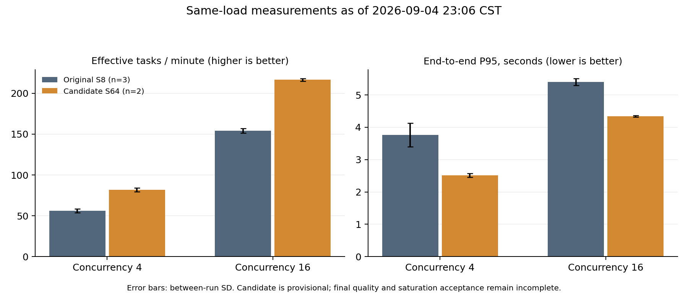
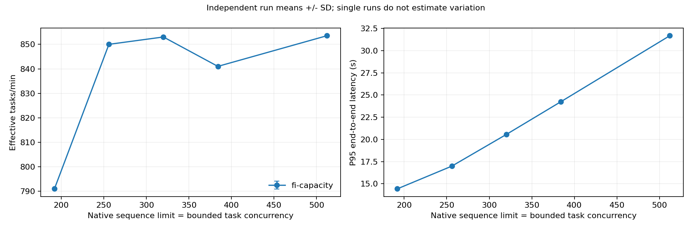

# CodePin vLLM 部署调优完整阶段报告

性能数据截止 **2026-09-04 23:06:04（UTC+8）**。本报告总结已经实际执行的方案、测量、失败与当前效果。主分支功能提取验收于当日 23:06:31 完成；性能实验仍在继续，尚未达到最终性能验收或可重复饱和边界。

## 1. 当前结论与交付边界

已建立真实 MCP 定位任务的端到端基准、固定真实轨迹回放和 Nsight Systems 分析链路。可独立交付的生产改动是完整内容哈希优化和并发前的原生工具 schema 初始化；它们连同已验收的 MCP、原生服务和数据评测功能被提取到主分支。逐提交内容和提取验收见 [主分支提取记录](MAINLINE_EXTRACTION_20260904.md)。

目前观察到的同负载候选收益如下。候选是 **S64 / B8192 / FI / G1024 / APC align** 加既有代码优化，原部署是 **S8 / B8192 / FA2 / 默认 Graph / APC align**。下表不是“仅改了一个参数”的消融，也不是主分支默认配置的已交付收益。

| 调参负载 | 原部署有效 tasks/min，3 次均值 | 候选有效 tasks/min，2 次均值 | 吞吐变化 | 原部署 / 候选 P95 秒 | P95 变化 |
|---|---:|---:|---:|---:|---:|
| P1 / C4 | 56.33 | 81.75 | +45.12% | 3.766 / 2.512 | −33.29% |
| P4 / C16 | 154.17 | 216.50 | +40.43% | 5.401 / 4.339 | −19.66% |

这些百分比是已完成运行均值的描述性比值。候选尚不足三次独立正式重复，也未完成新的独立任务、到达率和 15 分钟稳态验收。不能把本表写成最终提速或统计非劣效结论。



当前快照包含 **12 组完整真实测量、17,525 个提交任务、81,694 次模型请求**，逐组请求数等于实际轨迹轮数；另有一次固定轨迹回放。全部失败任务保留。机器可读逐组指标、原始摘要、新旧判定与样本量见 [current-evidence.json](assets/vllm-tuning/20260904-current-evidence.json)。

## 2. 固定的硬件、环境和模型

| 项目 | 实测或固定值 |
|---|---|
| GPU | NVIDIA RTX 6000D，**85,651 MiB**，计算能力 12.0；功率上限 600 W |
| 驱动 / 操作系统 | 595.71.05；Ubuntu 22.04.5，Linux 5.15.0-78 |
| CPU | Xeon Platinum 8470Q；可见 208 逻辑核，容器 CPU 配额 **22 核** |
| 内存 | 容器上限 **110 GiB**，无 swap |
| 存储 | XFS / RAID5 非旋转设备；数据盘配额 50 GiB |
| 网络 | eth0 MTU 1500，loopback MTU 65536；主对照在同机 HTTP / stdio MCP 上运行，不含公网 WAN 延迟 |
| Python / Torch | 3.12.14 / 2.11.0+cu128 |
| vLLM / Transformers | 0.23.0+cu129 / 5.8.0 |
| SkyRL | 0.3.0，`f5bc3b78dfddfb352870d5d7430cd226e5785838` |
| OpenHands | 1.7.1，`85ecfd9333d2d2cc4404dd460fd38868d9b978e2` |
| 模型 | `LeeXugar/CodePin-SFT-Qwen3.5-0.8B`，revision `4480baaf6a1b1f9fc0b3fb54c8480ed036c6f33a` |

权重 SHA-256：`d97009d9e41838a2eb8ce0e6275ac41cf80f1186915628f31662d3ba0b67e48e`。chat template SHA-256：`273d8e0e683b885071fb17e08d71e5f2a5ddfb5309756181681de4f5a1822d80`；EOS 为 248046，pad 为 248044，词表大小 248077。沿用标准 Qwen3.5 wrapper 和 `--language-model-only`，没有训练、修改权重或切换推理框架。

原工具链的 CUDA 12.8 无法完成该 SM12 GPU 上 FI 的原生 JIT。核验安装源码和失败日志后，在独立目录安装 NVIDIA 官方 CUDA 12.9.1 NVCC、cudart 与 CCCL 组件，逐件校验官方摘要。候选仅通过进程级 `CUDA_HOME` 使用它；没有修改系统驱动、Torch、vLLM 或模型。FA/FI 后端对照使用同一独立工具链，原始基线保留原工具链。所有组统一显式关闭不支持本机原生初始化的 FlashInfer sampler，保留 vLLM 原生采样实现及原失败记录。

当前对照的运行源码由 V95 的 54 文件摘要清单固定，对应阶段 `4a1c27a`；远端是原检出上的已核验源码覆盖，不把它误写成远端 Git HEAD。V102 新规则在独立离线分析目录运行，未改动测量中的服务源码。参数组间保留同一模型、请求预算和原生执行路径。

## 3. 工作负载、计时和质量定义

优化对象是完整调用链：任务提交 → 仓库内容检查 → 构造请求 → 模型生成工具调用 → 真实 glob/grep/read_file → 追加观察 → 下一轮推理 → localization_finish → 符号校验 → 有界上下文返回。

最初固定 13 个真实 SWE-Smith 任务：调参 8 个、原验证 5 个，仓库不交叉，覆盖 4 easy、6 medium、3 hard；仓库含 68–4623 个源文件、约 0.48–89.45 MB。已捕获轨迹为 3–8 轮，初始上下文约 1747–5994 token。报告不推断未测量的 16K 以上实际任务表现。

原五任务后来用于配置筛选，因此不再称为一次性盲测。另按预先固定的随机排列选出七个未参与模型推理的新仓库任务，索引为 `[24,18,30,93,42,47,83]`，5 easy、2 medium。全部三个 hard 任务已在原集合中，不能补称为新的独立困难任务；七项截至快照仍未执行模型请求。部分原数据的 added-method 目标在变异快照中不存在，原标签仍保留，不以删除目标抬高 F1。

**有效任务**固定为：正常结束、无轨迹错误、无结果缓存命中、原 Localization 奖励至少 0.5、工具错误为零，并返回非空且不超过 12000 字符 / 160 行的上下文。原奖励是 file/module/entity F1 之和，范围 0–3；另报告 file/class/function F1，二者不是同一个求和口径。

- 主对照关闭完整定位结果缓存；Prefix Cache 按方案开启或关闭。
- temperature 0、top_p 1、配置 top_k 20；原生贪心请求实际规范化为 top_k 0、per-request seed None，引擎 seed 0。任务顺序 seed 为 20260904。
- 每任务最多 8 轮、每轮最多 2048 输出 token；工具、上下文、正确性门槛不因调优缩小。
- 连续运行先预热 30 秒，再正式运行至少 180 秒，固定 `[60,180)` 为稳态；冷前缀验证为 10 个完整任务块，块间重置原生前缀缓存。
- 仓库事先物化，准备时间单列；每次任务的前后完整内容哈希、排队、模型、工具、校验和上下文返回均计入任务时延。文件系统使用自然缓存，不清除全机页缓存。
- 吞吐按稳态窗口内完成的有效任务计数；P50/P95 按该窗口内提交的完整任务队列计算，包含窗口结束后才返回的失败或超时。
- 原始 wave 负载、回放和 profiling 只作为诊断；持续补充任务的端到端测量才用于容量验收。

## 4. Append-only 场景的实际性能特点

实际 TokenEvent 的 prompt/response token 来自 vLLM 原始返回，不用本地重新编码的文本替代。多组真实轨迹逐数组核验：后一轮 prompt 保留前一轮 prompt 加生成结果作为完整前缀；工具观察随后追加。例如 38 轮中的 30 个跨轮连接全部满足严格追加，另一组 57 轮行为变体也通过。

这不意味着零重复计算：SDK 每轮仍发送完整历史，API 仍要接收、解析、渲染、tokenize 和查缓存。逻辑追加、重复发送完整历史、服务端实际免算 token 必须分开观察。

针对 8 个真实任务、38 轮请求，调用原生 render 接口各重建三次，114/114 次 prompt token 与 TokenEvent 完全一致。紧凑 JSON 序列化均值 0.101 ms；包含本机 HTTP、解析、模板和 tokenization 的往返均值 9.835 ms、P95 14.342 ms。这个诊断不生成 token，不能把往返时间全部算成 tokenizer 耗时。

模型的 24 层采用 `[GDN, GDN, GDN, full attention] × 6`。当前 vLLM 为这组混合状态选择 **544 token** 缓存对齐，状态填充增加约 2.64%。跨任务公共前缀约 1646–1647 token，对齐后可复用 1632；任务内已捕获连接的对齐复用长度约 1632–5440 token。它依赖原生 KV/GDN 状态保存与对齐，不能套用纯 Transformer 任意位置的 KV 结论。

第二次候选 C16 的真实服务计数为：

| 计数 | token / 次数 |
|---|---:|
| 前缀查询 token | 21,804,730 |
| 查询命中 token | 19,906,592 |
| 原生来源统计中的实际本地缓存复用 token | 19,895,712 |
| 原生来源统计中的本地计算 token | 1,897,422 |
| 外部 KV transfer token | 0 |
| 原生模型请求 | 6264 |
| 调度抢占 | 0 |

查询命中量与实际复用来源计数并不完全相同，不能把前者直接当作全部免算工作。零抢占也不等于证明所有缓存块从未淘汰；最终配置的细粒度淘汰/重计算诊断尚未完成。

## 5. 已尝试方案、方法和取舍

记号：S 为引擎 max_num_seqs，C 为任务并发，P 为 MCP 客户端数，B 为 max_num_batched_tokens；G1024 表示保留原生小批捕获尺寸并补充到 1024，而非只捕获单一尺寸。除明确注明的消融，均使用完整真实模型决策和工具执行。

| 方案与针对瓶颈 | 具体方法及结果 | 优点、代价与当前决定 |
|---|---|---|
| 仓库哈希 CPU 开销 | 完整内容检查改用 scandir；13 个实际快照的摘要与旧实现完全一致。仅函数体不同的三组交替对照，S8/P1/C4 的短稳态有效吞吐从 62.4±2.4 到 82.4±0.69（均值±SD） | 不改变失效语义，已提取到主分支。配对吞吐差 +20.00±6.21 tasks/min（95% 半宽）；P95 差 −0.233±0.253 秒，区间跨零，不能宣称显著改善尾时延 |
| 并发首次初始化 | 冷并发会话触发 SDK 工具类型重复注册及未定义类型；先锁 schema 转换仍不充分，最终在模块导入阶段完成原生注册与 Agent schema 构建 | 直接修复真实可靠性问题，已提取并重新验收；没有对 SDK 打补丁 |
| HTTP/工具初始化复用 | Nsight 基线 266 次模型请求仅有 4 次 TCP connect；socketpair 累计约 3.67 ms，工具初始化约 5.93 ms | 已有连接复用；证据不支持另造连接池或缓存 Agent 对象，未实施 |
| Prefix Cache | S64/G1024/B8192/C16：align 181.5 tasks/min、P95 3.641 秒；none 100.0、6.978 秒。C4：align 69.5、2.139；none 55.0、2.812 | 单次路径筛选支持保留原生缓存，但 C16 align 在当时严格规则下失败；不以吞吐掩盖行为差异。none 的查询、命中、复用均为零 |
| 降低 batch token | B1024/C64 362.5、P95 7.772；C96 302.5、13.385；都未形成合格改善 | 未优于相应 B8192 路径，且行为检查失败，未采用 |
| B 邻域 | 早期 S256/C256 下 B4096、8192、16384 分别约 841、850、845.5 tasks/min | 没有扩大 token 预算越大越快的证据；B8192 保留为候选，非全局最优证明 |
| 同步调度 | S64/G1024/B8192 关闭 async 后，C64 为 310.5/P95 9.112，C16 为 148/4.629 | 低于对应 async 路径且严格检查失败，未采用 |
| 原生 full-attention 后端 | 相同 S256/P32/C256/工具链，FA2 751.0/P95 20.407，FI 850.0/17.130，单次 +13.2% 吞吐、−16.1% P95 | 值得进一步验证；需要独立 CUDA12.9 编译组件。GDN 仍是原生 Triton/FLA，不能称整个模型都换成 FI |
| 扩大 Graph 捕获 | S64/C64：G128 363.0、G1024 405.0、G4096 405.0；C96：260.0、319.5、316.0 | G1024 对已观察 launch 路径有收益，G4096 无追加收益；六组在原严格质量规则下均失败，未作为生产默认 |
| 增加 MCP 供给 | 早期 S256/C256，P32 850.0、P64 861.0，P95 均约 16.98 秒 | 单次仅 +1.29%；MCP 启动约 112→223 秒，匿名内存约 19.32→27.72 GiB，不采用更多进程 |
| 增加 API worker | 同一 S256/P32/C256，API2 693.0/P95 22.805，相比 API1 吞吐 −18.47%、P95 +34.27% | 增加协调成本，未改善供给，保留单 API |
| 原生 batch invariance | FI 启动校验拒绝；FA 进一步因 GDN_ATTN 不支持而拒绝。上游相关支持仍未形成当时可用的兼容版本 | 两次失败均保留；不改支持标志、不加载未合并补丁，没有通过绕过校验得到“确定性” |
| 其他模型执行选项 | 当前为 FA2，max_num_splits 的相关路径只适用于 FA3；GDN 的 FI/CuteDSL 路径不支持本机 SM12 | 不把不生效的参数当优化，不增加机器兼容层 |
| 量化、KV 精度、投机解码、offload | 没有足够证据证明当前主要受权重/缓存容量或带宽所限，未开展这些候选 | 会引入额外质量、支持与维护变量；暂不预设它们有效，也不声称已经比较过 |

哈希短窗口消融与本报告新的长窗口组合比较不是同一实验；不能相减来精确分摊 FI、Graph、并发和代码各自的贡献。所有未通过配置及其原始记录保留在调优分支的分阶段材料中。

## 6. 容量和压力曲线：观察到局部平台，尚未完成最终饱和验收

早期 FI/B8192/API1/P32 调参筛选得到以下结果，每项一次 180 秒运行，统计 `[60,180)`：

| S / C | 有效 tasks/min | P95 秒 |
|---|---:|---:|
| 192 / 192 | 791.0 | 14.426 |
| 256 / 256 | 850.0 | 16.984 |
| 320 / 320 | 853.0 | 20.553 |
| 384 / 384 | 841.0 | 24.236 |
| 512 / 512 | 853.5 | 31.676 |
| 256 / 128 | 602.0 | 13.039 |
| 256 / 320 | 684.5 | 28.345 |
| 256 / 384 | 686.5 | 32.336 |
| 256 / 512 | 676.5 | 42.965 |



同步增加 S/C 在 256 附近出现平台；固定 S256 继续增加任务压力，排队和尾时延明显恶化。C320 的平均 running/waiting 请求约为 251.38/46.99，引擎约占一个 CPU 核；缓存查询命中率仍约 91.37%，未发生调度抢占。模型请求 TPOT 从 C256 的约 17.09 ms 增至 36.09 ms，decode 从约 0.961 增至 2.049 秒。

这些点只建立局部诊断线索。后续在原验证任务中出现了额外错误工具轮次或定位失败，因此不能把 850 tasks/min 当成已验收生产容量。旧严格筛选中 S64/C64 曾单次通过（388.5/P95 7.364），随后邻域和更长测量仍出现行为变化：

| 原验证任务的单次筛选 | 有效 tasks/min | P95 秒 | 结果 |
|---|---:|---:|---|
| S64 / C96 | 268.0 | 15.327 | 失败，排队增加 |
| S64 / C128 | 279.5 | 18.908 | 失败 |
| S64 / C192 | 270.0 | 28.782 | 失败 |
| S80 / C80 | 411.0 | 8.743 | 失败 |
| S96 / C96 | 480.5 | 8.877 | 失败 |

完整原部署本身也会出现少量模型行为变化，因此随后补齐三次原部署长测，重新冻结参考后再做新候选实验。未将任何旧失败改成通过。目前 S128/S256/S512 的新原生 Graph 容量筛选、到达率边界和邻域重复仍待完成，不能提前将 S64 选作最终容量上限。

## 7. 可信基线、当前效果及资源变化

原部署固定提交 `9e56b61`，六种条件各三次独立引擎测量，**12,086 次真实任务、54,051 次模型请求**。第二轮缺失的两组 C8 和回放随后补齐；已经完成的失败组保留，不称为相邻时间配对。

| 原部署条件 | 有效 tasks/min，均值±95% CI 半宽 | P50 / P95 秒 | 文件 / 类 / 函数 F1 | 有效率 |
|---|---:|---:|---:|---:|
| 调参 C4 | 56.33±5.87 | 1.794 / 3.766 | .3833 / .2500 / .3833 | 50.00% |
| 调参 C8 | 130.00±1.24 | 1.887 / 3.255 | .3833 / .2500 / .3833 | 50.00% |
| 调参 C16 | 154.17±7.28 | 3.232 / 5.401 | .3833 / .2500 / .3833 | 50.00% |
| 验证 C8 | 110.33±1.90 | 1.442 / 2.825 | .3996 / .3329 / .1996 | 39.96% |
| 验证 C16 | 127.83±9.40 | 2.242 / 4.836 | .3635 / .3019 / .1786 | 36.35% |

冷前缀验证 C4 的全程有效吞吐为 45.49±2.23、P50/P95 1.880/2.864 秒，有效率 40%。三次固定轨迹回放为 159.61±8.01 tasks/min；回放没有真实模型决策和工具执行，不作为有效定位吞吐。

原部署第二次验证 C16 的 1285 次提交有 321 次 SDK 初始化异常。162 次包装为 RuntimeError，159 次为 PydanticUndefinedAnnotation。旧分类漏掉后者；修正分类后的异常率为 24.981%，原日志的 12.607% 保留。全部失败一直在全局吞吐/F1 分母中；另外修复了逐任务 F1 汇总遗漏无测量失败记录的问题。

当前候选的补充结果：

| 候选条件 | 次数 | 有效 tasks/min | P50 / P95 秒 | 与原部署比较的含义 |
|---|---:|---:|---:|---|
| 调参 C4 | 2 | 81.75 | 1.526 / 2.512 | 同负载；吞吐 SD 2.475，P95 SD .055 秒 |
| 调参 C16 | 2 | 216.50 | 2.242 / 4.339 | 同负载；吞吐 SD 1.414，P95 SD .025 秒 |
| 调参 C64 | 1 | 452.00 | 3.345 / 8.705 | 比原 C16 吞吐 +193.19%，P95 +61.17%；这是容量/时延取舍，不能称同负载加速 |
| 验证 C16 | 1 | 180.00 | 1.564 / 3.694 | 同负载描述性吞吐 +40.81%，P95 −23.61% |
| 验证 C64 | 1 | 403.00 | 2.713 / 7.011 | 比原 C16 吞吐 +215.25%，P95 +44.97%；负载不同 |
| 冷前缀验证 C4 | 1 | 54.38 | 1.684 / 2.412 | 全程冷块计时；吞吐 +19.56%，P95 −15.80% |

调参 C4 的 F1 仍为 .3833/.2500/.3833；C16 为 .383429/.250000/.383446，有效率仍为 50%。当前候选全部无基础设施异常或超时；部分低分任务出现了定位与上下文成本同时上升的变体，见下一节。验证组的全量有效率分别约 39.85%（C16）、39.84%（C64）、40%（冷 C4），不能省略这些失败。

以下补充调参 C16 的全量结果与工具行为。工具项为每任务均值，包含失败轨迹；“正常结束”还不代表达到有效门槛。稳态终态任务按完成时间计数，与窗口内提交队列的有效率不必严格相乘相等。

| 指标 | 原 S8，3 次均值 | 候选 S64，2 次均值 |
|---|---:|---:|
| 稳态终态任务数/min，含失败 | 308.667 | 432.000 |
| 全程正常结束率 | 50.000% | 50.152% |
| 全程非正常结果率 | 50.000% | 49.848% |
| 基础设施异常率 / 超时率 | 0 / 0 | 0 / 0 |
| 工具调用次数 / 轮数 | 4.750 / 4.750 | 4.745 / 4.745 |
| 工具错误次数 | 2.250 | 2.244 |
| 重复搜索 / 重叠读取行数 | 0 / 0 | 0 / 0 |
| 读取行数 | 117.875 | 118.180 |
| 输出字符数 | 5289.118 | 5303.678 |
| 过量输出字符数 | 171.000 | 173.436 |
| Tool Efficiency 成本 | .118811 | .119036 |

输出与成本的小幅增加没有被隐藏或奖励为无条件收益；下文明确记录其对应定位变体以及新旧判定。

小样本波动必须保留：C4 两次候选吞吐均值的 t 区间半宽约 22.24，C16 约 12.71；两个样本不足以稳定估计长期方差。图使用 SD，基线表使用 95% CI，二者未混用。当前回放为 168.44 tasks/min、零请求错误，仅一次，未作为端到端提速结论。

同一 S64/G1024/独立工具链的 FA2 对照在 C4 两次均值为 83.75/P95 2.474，C64 为 463.0/8.510；对应 FI 为 81.75/2.512 和单次 452.0/8.705。**在当前 S64 负载下，FI 尚未表现出稳定优势**；不能把早期 S256 的 +13.2% 后端收益推广到低并发或另一 Graph 配置。

同为调参 C16，资源和模型阶段的当前对照如下。资源统计取稳态，模型请求统计覆盖完整正式运行，不可与端到端分位数直接相加：

| 指标 | 原 S8，3 次均值 | 候选 S64，2 次均值 |
|---|---:|---:|
| GPU 活动利用率采样 | 59.61% | 63.46% |
| 容器 CPU 配额使用率 | 15.58% | 14.85% |
| 引擎 CPU 核等效占用 | 1.027 | 1.026 |
| 主机匿名内存 | 约 5.57 GiB | 约 5.73 GiB |
| GPU 已用内存 | 约 59.47 GiB | 约 59.50 GiB |
| 容器块设备读取 / 写入 | 0 / 15.46 KB/s | 0 / 18.07 KB/s |
| 平均等待中的引擎请求 | 5.195 | 0 |
| TTFT | 242.22 ms | 59.60 ms |
| 请求排队 | 189.68 ms | 0.019 ms |
| prefill | 30.83 ms | 36.83 ms |
| TPOT | 5.209 ms | 5.778 ms |
| decode | 296.25 ms | 329.33 ms |
| 前缀查询命中率 | 91.254% | 91.285% |
| 生成 tokens/s | 1398.86 | 1971.81 |

任务整体更快，同时单请求 TPOT/prefill/decode 并未都改善；该组合的重要变化是队列消失、可同时推进的任务增加。缓存命中率几乎不变，不能把整体收益全部归于 Prefix Cache。它也不能独立证明是哪一种 GPU 后端导致队列变化，仍需保留单因素对照。

块设备读取为零指这段自然页缓存状态下的容器 I/O 计数，不表示没有文件读取或没有哈希计算。

## 8. 质量判定的修正及其限制

V86 参考仅由三次原部署生成，同时限制每任务有效率、各级质量极值、工具成本极值和每次运行的均值；CI 不扩大允许范围。基础设施失败留在全量统计中，但不能用它降低模型/工具的条件质量门槛。

一个真实反例暴露了“所有成本增加都算退化”的局限：`kurtmckee__feedparser.cad965a3.pr_417` 的原 C16 基线 350 次都为零分、6 轮、4 次工具错误、输出 69 字符。少量候选结果正确返回 `feedparser/encodings.py::convert_to_utf8`，分数升到 .20324，3 轮、零工具错误，但读取 200 行、输出 9621 字符、1598 过量字符、1 次截断，原工具成本从 .05069 升到 .19817。

该结果仍低于 .5 的有效门槛，**不会提高有效 tasks/min**。定位改善不证明每行读取都必要，原成本和奖励仍保留。V102 显式选择性规则只将“无错误、各级质量不低于所有基线最好值且至少一个 F1 改善”的上下文成本超界单列；普通结果的成本增长、重复搜索、重叠、额外轮次、质量退化等仍受原门槛约束。

V102 在 22:42:10 冻结，早于第二、三轮候选引擎；第一轮仅用于诊断，原 V86 失败不改写。需至少三次冻结后的新引擎才能按该规则正式确认。34 项相关分析测试通过，但这套分析规则未进入本次主分支生产功能，也未改变训练 reward。

## 9. Nsight 的实际使用与归因

按用户指定的[参考文章](https://zhuanlan.zhihu.com/p/718956195)，重点查看 CPU/GPU 时间线、NVTX、CUDA stream、同步和拷贝重叠，并单独评估采集开销。具体参数以实际工具版本及 [NVIDIA Nsight Systems 文档](https://archive.docs.nvidia.com/nsight-systems/2025.1/UserGuide/index.html) 为准。

本机原有 Nsight Systems 2025.1.1.0，路径为 `/opt/nvidia/nsight-compute/2025.1.1/host/target-linux-x64/nsys`；实际复用并核验，没有声称重新安装过系统工具。补齐固定的 Python NVTX 依赖，并核验实际加载的 CUDA `libnvToolsExt.so.1`。CPU perf sampling/context-switch 权限不可用，因此显式关闭这些选项；CUDA、NVTX、OS Runtime 真实可用。Nsight Compute 定点尝试收到 `ERR_NVGPUCTRPERM`，未修改宿主机权限，不报告不存在的 SM/DRAM 指标。

采集由 `scripts/profile_serving.py` 管理实际 API、GPU worker 和真实 MCP 客户端进程树，健康检查和模型预热后才打开 NVTX 范围。记录 task/conversation ID、实际模型 response ID 和工具轮次，区分累计资源耗时、区间并集与单任务关键路径。

| 实际 trace / 观察 | 证据及解释 |
|---|---|
| 初始 baseline-e2e-v2 | 56 任务、266 step，GPU 区间并集占 56.37%；大于 10 ms 的空闲 5.629 秒，其中 4.583 秒与仓库哈希重叠，为哈希消融提供方向，时间重合本身不代替因果实验 |
| S8 饱和 trace | 144 任务、684 step，稳态 GPU 区间并集约 47.77%；无大于 10 ms 的空闲，引擎约一个 CPU 核，提示检查调度和 launch 路径 |
| 单任务图级 serial-v13 | 24 任务、114 step；工具结束→下一 Agent step 均值 1.747 ms，→下一 GPU 操作均值 32.340 ms；后者还含请求构造、HTTP、渲染和调度 |
| FA2 高并发 v11 | 1504 任务、7144 step，全部关联真实 response ID；full-attention split-KV 占累计 kernel 时间约 30.47% |
| FI 高并发 v23 | 1648 任务、7828 step；full-attention 占比约 15.57%，GDN decode/update 升为约 23.58%；耗时组成改变，不等于已证明显存带宽饱和 |

同步 API 时间不能直接作为可消除空闲：FA2 同一 20 秒窗口的主机 event synchronize 区间并集 2.821 秒，其中 2.808 秒与 GPU 工作重叠；真正未重叠仅约 12.901 ms。H2D 拷贝累计约 18.238 ms，现有数据不支持优先增加一套多流预取机制。OSRT 中多个线程 read 的累计阻塞时间也不能当作磁盘关键路径。


S64/G128 的两个代表性 15 秒窗口进一步定位了原生 Graph 路径变化：

| 指标 | C64 | C96 |
|---|---:|---:|
| 完整 forward 数 | 1053 | 615 |
| 单次 Graph 路径占比 | 70.37% | 36.59% |
| 无 Graph 路径占比 | 27.35% | 57.56% |
| 无 Graph 主机 forward 均值 | 28.55 ms | 28.33 ms |
| 单 Graph 主机 forward 均值 | .608 ms | .688 ms |
| GPU 执行区间并集 / 15 秒 | 48.09% | 33.10% |

这些观察把吞吐反降的排查重点指向原生 Graph/提交路径，并支持扩大原生捕获尺寸的实验。但没有记录每批精确 token 数，不能断言每次回退都由同一尺寸触发；主机 forward 含等待，不能把 28 ms 全算作 CPU 忙碌时间。共享批次的 kernel 时间也不能按简单时间重叠分配给某个任务。

采集和正式计时分开。单对无采集/采集诊断的吞吐扰动为：串行图级约 −6.3%；FA2 高并发约 −6.9%；FI 高并发约 −4.6%；S64 C64/C96 节点级约 −13.23%/−14.63%。这些都是单对诊断，不冒充三次重复。早期 profiler API 门控和节点级串行采集发生停滞/超时，失败 trace 与日志保留，没有计入正常性能。

下面还原实际运行的 C64/v55 采集、统计和分析命令；参数原件见 `stage3-material-v60/configs/command-quality-boundary-c64-nsys-v55*.json`。这些历史输出已存在，新采集必须换用新的输出前缀和客户端目录，不能直接覆盖：

```bash
NSYS=/opt/nvidia/nsight-compute/2025.1.1/host/target-linux-x64/nsys
RUN=/root/autodl-tmp/codepin/runs/20260904-vllm-agent-performance
NAME=quality-boundary-c64-nsys-v55
PYTHON=/root/autodl-tmp/codepin/.venv/bin/python
cd /root/autodl-tmp/codepin
"$NSYS" --version
NSYS_NVTX_PROFILER_REGISTER_ONLY=0 "$NSYS" profile \
  --trace=cuda,nvtx,osrt --sample=none --cpuctxsw=none \
  --capture-range=nvtx --nvtx-capture=codepin.benchmark \
  --capture-range-end=stop --cuda-graph-trace=node \
  --output "$RUN/profiles/$NAME" \
  "$PYTHON" -m scripts.profile_serving \
  --server-script "$RUN/configs/serve-$NAME.sh" \
  --tasks "$RUN/configs/workload-v3/tasks.jsonl" --split validation \
  --repository-root /root/autodl-tmp/codepin-performance-workspaces-20260904-v3 \
  --concurrency 64 --mcp-clients 32 --continuous \
  --minimum-duration 30 --warmup-duration 30 --output "$RUN/results/$NAME"
"$NSYS" export --type sqlite --output "$RUN/profiles/$NAME.sqlite" "$RUN/profiles/$NAME.nsys-rep"
"$NSYS" stats --report cuda_gpu_kern_sum,cuda_api_sum,nvtx_sum,osrt_sum \
  --format csv "$RUN/profiles/$NAME.nsys-rep"
"$PYTHON" -m scripts.analyze_nsight --sqlite "$RUN/profiles/$NAME.sqlite" \
  --output "$RUN/profiles/$NAME-analysis.json" \
  --timeline "$RUN/profiles/$NAME-timeline.png" \
  --trajectories "$RUN/results/$NAME/trajectories" \
  --benchmark-records "$RUN/results/$NAME/capture/records.jsonl" \
  --steady-window 10 25 --cuda-details
```

离线分析与压测工具仍位于调优分支；最小运行时埋点和按 execution ID 导出轨迹的能力已进入 main。服务端记录脚本显式开启 `VLLM_NVTX_SCOPES_FOR_PROFILING=1`，无采集配对保留相同 NVTX/轨迹导出开关。实际分析使用 nsys stats、SQLite 的 CUDA/NVTX/OSRT 区间查询和导出图；GUI 可离线打开保留的 `.nsys-rep`，先定位 `codepin.benchmark`，再关联 task/service/step 与原始 response ID。本报告不声称已经在 GUI 中完成了未实际操作的步骤。

## 10. 当前瓶颈如何迁移，以及下一步条件

早期低并发存在明显仓库哈希间隙；保持完整内容校验的 CPU 优化有独立消融支持。随后 S8 在更多任务同时进入时形成引擎排队，扩大原生序列容量改善了同负载 E2E；新 C16 的排队接近零，但 decode 和 TPOT 略变慢。高压力下又观察到更多无 Graph 的混合批次路径和 GPU 空隙，扩大原生捕获范围有局部收益，G4096 没有追加收益。

现有证据更支持关注引擎的串行调度/提交、混合模型的原生 Graph 支持与批次组织，而非简单认定“GPU 高利用率就是算满了”或“显存已经不够”。供给翻倍与 API worker 增加都没有解决问题；工具执行后 Python 衔接仅为毫秒量级，连接也已复用。

**仍未证明当前硬件下最终可重复饱和边界。** 需要完成新的容量与到达率邻域、关键交互和至少三次重复，再对选定组合采集 Nsight、验证不少于 15 分钟的吞吐/尾时延/队列/内存趋势，并运行七项独立任务。最终配置的缓存淘汰/重计算细节也仍待补充。若进一步优化需要改变条件，当前有依据的方向是更完整的原生 GDN/Graph 支持、更低的调度提交开销，或在充分测量后调整供给和硬件；现阶段没有证据保证增加 GPU 显存、CPU 总核数、量化或 offload 就能提速。

收益主要在当前 1.7K–6K 初始上下文、3–8 轮工具任务、C4/C16 的已测组合中可见。跨任务长度、轮数、难度的分层独立提升尚未完成统计，不能声称某种长上下文任务收益最大。吞吐优先与时延优先的最终配置尚未发布；主分支继续保留已验收的原部署默认值。

## 11. 完整材料与复现路径

云端实验根目录为 `/root/autodl-tmp/codepin/runs/20260904-vllm-agent-performance/`，本地材料根目录为 `tmp/verification/20260904-vllm-performance/`。性能实验源码、启动/压测/Nsight 入口和固定任务规格保留在 [调优分支的固定阶段提交](https://github.com/PeterLeeXX/CodePin/tree/0a4503c0e6c43beb459b12ead93af34e6094391d)。更细的逐阶段过程见该提交的 [PERFORMANCE_TUNING_20260904.md](https://github.com/PeterLeeXX/CodePin/blob/0a4503c0e6c43beb459b12ead93af34e6094391d/docs/PERFORMANCE_TUNING_20260904.md)。

本机完整材料实际位于 `E:\Desktop\CodePin\tmp\verification\20260904-vllm-performance\`。原部署启动参数见 `baseline-material-v87/configs/serve-baseline-repeat-v74-r1.sh`，候选见 `current-report-material-v110/configs/serve-fresh-candidate-v95-r2.sh`。候选保留原生编译与 chunked prefill，唯一 Graph 列表是 `[1,2,4,8,16,24,32,40,48,56,64,72,80,88,96,104,112,120,128,256,512,1024]`；attention backend 为 `FLASHINFER`。上下文 16384、显存预算 0.70、B8192 和请求输出预算均未缩减。

以下还原该候选第二轮 C16 的正式测量命令，前置同条件 30 秒预热另存原记录；历史输出已存在，复现实验须另建输出目录。所有未显式参数以同一源码和已保存的 summary/config 为准，包含 seed 20260904、timeout 180 秒、8 轮、2048 token 和完整结果缓存关闭：

```bash
RUN=/root/autodl-tmp/codepin/runs/20260904-vllm-agent-performance
cd /root/autodl-tmp/codepin
.venv/bin/python -m scripts.benchmark_performance e2e \
  --tasks "$RUN/configs/workload-v3/tasks.jsonl" \
  --repository-root /root/autodl-tmp/codepin-performance-workspaces-20260904-v3 \
  --require-context --mcp-clients 4 --client-concurrency 16 \
  --service-concurrency 16 --minimum-duration 180 --continuous \
  --reset-prefix-before --split tuning \
  --output "$RUN/results/fresh-candidate-v95-r2-p4-c16"
```

| 材料 | 本地子目录 / 关键文件 | 验证范围 |
|---|---|---|
| 完整原部署基线 | `baseline-material-v87/`，`results/baseline-report-v92/` | 448 个条目校验通过；18 组 E2E、3 次回放及全部失败 |
| 原生 Graph / Nsight | `stage3-material-v60/` | 2158 个条目校验通过，含两份 `.nsys-rep`、SQLite、CSV 和原始轨迹 |
| Graph 范围对照 | `stage4-material-v63/` | 155 个原始条目；六项筛选及失败 |
| 缓存/调度路径 | `stage5-material-v69/` | 234 个条目校验通过 |
| 成本判定修正 | `context-policy-material-v103/` | 34 个条目校验通过，原始结果和 V86/V102 均保留 |
| 本报告当前快照 | `current-report-material-v110/` | 137 个条目校验通过，12 组已完成测量和 1 次回放 |
| 主分支提取验收 | `stable-main-material-v111/` | 47 个条目校验通过，55 项测试及真实闭环 |

本报告快照压缩包为 6,100,253 bytes，SHA-256 `1a6fa148b448f74a5fa6b7b315a96121a39bca09a945036fd8ac6118ad723eb3`。原始逐任务 `records.jsonl`、资源采样、Prometheus 前后快照、summary、启动命令和测量源码快照均保留。当前汇总由 `configs/analyze_current_report_v112.py` 使用已核验材料计算；统计 JSON 和图表随本报告提供，完整原始数据留在实验材料中。

该汇总脚本的 SHA-256 为 `1029d8ec4d701232c4ffd6453371c4cd94180f4433d8151e894fc60711cd98e6`，本次实际在本地调优仓库执行 `E:/Python312/python.exe -X utf8 -m tmp.analyze_current_report_v112`。它逐件检查原始记录、参考门槛和新旧统计的一致性，不发起模型请求；原脚本保留本次本地输入/输出路径和拒绝覆盖的创建方式，迁移复现时需显式改为自己的材料及新输出目录。

统一功能复现入口是主分支的 `scripts/run_acceptance.sh`；完整性能复现使用调优分支的 `scripts/prepare_performance_workload.py`、`scripts/benchmark_performance.py`、`scripts/report_performance.py` 和 `scripts/profile_serving.py`，以及材料内每次实际启动的 `configs/serve-*.sh`、`configs/command-*.json`。历史脚本固定了本次路径和独占输出目录；新实验应准备新目录，保留原始记录，不覆盖或补写旧结果。

本次交付的结论是：生产功能与两项小改动已重新验收；局部性能收益有真实证据，多个无效或退化方案已排除；最终调优配置、独立质量非退化和可重复饱和边界仍未完成。云端性能调度已在功能验收后恢复，未执行关机。
