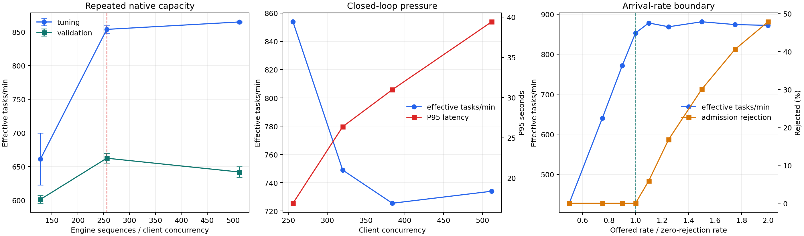

# CodePin vLLM 部署性能调优与端到端验收报告

本报告记录现有 `CodePin-SFT-Qwen3.5-0.8B` 在真实代码定位 Agent 工作负载下的部署调优。实验保持模型权重、tokenizer、chat template、EOS、SkyRL 和 vLLM 框架不变，不开展训练；性能主对照关闭完整定位结果缓存，失败任务不从统计中删除。

结论分为两层。三次独立引擎的短稳态对照、容量边界、原部署完整 82 项回归和本机 Codex 到远程 CodePin MCP 的真实定位链路均已完成。默认 S64/FA2 配置在 C16 将有效吞吐从 154.17 提高到 229.83 tasks/min（+49.08%），P95 从 5.401 秒降到 4.046 秒（−25.09%）。15 分钟运行中的吞吐、P95、质量和 GPU 显存保持稳定，但 MCP 客户端进程匿名内存持续增长，预声明稳定性门槛未通过。因此本报告交付可复现的短时性能配置和真实服务链路，同时把长期常驻服务标记为尚未验收，不能声称生产长期稳定性已经通过。

## 1. 冻结对象与实测环境

| 对象 | 冻结值 |
|---|---|
| 基线代码 | `9e56b610e9e366a22744751dc5ff70052e826c8d` |
| 模型 revision | `4480baaf6a1b1f9fc0b3fb54c8480ed036c6f33a` |
| 权重 SHA-256 | `d97009d9e41838a2eb8ce0e6275ac41cf80f1186915628f31662d3ba0b67e48e` |
| tokenizer EOS / pad | `<|im_end|>` 248046 / 248044 |
| chat template | 7755 bytes，SHA-256 `273d8e0e683b885071fb17e08d71e5f2a5ddfb5309756181681de4f5a1822d80` |
| GPU | NVIDIA RTX 6000D，85,651 MiB，计算能力 12.0，600 W 上限 |
| CPU / 容器配额 | Xeon Platinum 8470Q；可见 208 逻辑核，实际配额 22 核 |
| 内存 / swap | 110 GiB 上限，无 swap |
| 存储 | 50 GiB XFS/RAID5 非旋转卷 |
| 驱动 / 系统 | 595.71.05 / Ubuntu 22.04.5 / Linux 5.15.0-78 |
| Python / Torch | 3.12.14 / 2.11.0+cu128 |
| vLLM / Transformers | 0.23.0+cu129 / 5.8.0 |
| SkyRL / OpenHands | 0.3.0 / 1.7.1，均锁定到项目声明提交 |

模型通过 vLLM 原生 `Qwen3_5ForConditionalGeneration`、`--language-model-only` 和 bf16 加载。模型 24 层，每三层 linear attention 后一层 full attention。当前 vLLM 将混合 KV/Mamba 缓存按 544 token 对齐，实测填充开销 2.64%；相关结论不能按纯 Transformer 的 KV cache 模型外推。

## 2. 工作负载与公平比较

真实端到端链路为：任务提交、仓库边界与摘要、请求构造、模型生成工具调用、`glob/grep/read_file` 执行、观察追加、下一轮推理、`localization_finish`、结构化校验和有界上下文返回。调参集与验证集覆盖 8 个真实任务，最终另用 7 个仓库不重叠、调参过程中未查询的任务做独立验证。

“有效任务”在比较前冻结：任务必须正常结束，结构化输出可校验，并达到冻结的定位质量和工具行为门槛。文件、类、函数 Localization F1、工具错误、重复搜索、重叠读取、输出量、截断和 Tool Efficiency 成本均保留。缩短必要上下文、排除失败、放宽 F1 或直接返回结果缓存都不能提高有效 tasks/min。

正式重复采用固定顺序、种子、温度 0、top-p 1、top-k 20、最多 8 个工具轮次、每轮最多 2048 输出 token、16,384 上下文。每项三次独立引擎；短稳态为独立 30 秒预热、180 秒正式运行并取 `[60,180)`，长稳态为 120 秒预热、960 秒正式运行并取 `[60,960)`。冷前缀、热前缀、固定轨迹回放、闭环并发和到达率分别报告。

## 3. Append-only 场景的性能特点

真实 token 序列核验表明，同一任务的后一轮 prompt 保留前轮 prompt、模型工具调用和工具观察，工具参数采用稳定 JSON 序列化，没有时间戳或随机路径写入历史，因此任务内历史是严格 append-only。请求仍会通过 HTTP 重发完整历史；append-only 只为服务端原生缓存提供复用机会，不代表客户端没有重复传输，也不代表 prefill 自动为零。

任务间共享系统提示、工具 schema 和固定指令前缀，任务内还共享逐轮增长的完整历史。原生 APC 查询和命中约 91%，但 Qwen3.5 混合注意力还受 544-token 块对齐、Mamba 状态检查点、容量和淘汰约束。工具执行形成短暂 CPU 间隔，缓存是否仍驻留必须由原生事件与 token 来源验证，不能从 prompt 文本相似度推断。

这个负载的每项任务需要多轮短 decode 和不断变长的 prefill。低并发时，仓库摘要、Agent 初始化和工具衔接占比明显；并发上升后，原 S8 服务先出现排队，扩大原生序列容量和图捕获范围才成为主要收益。单请求 decode 或 TPOT 没有同步变快，端到端吞吐提升主要来自减少排队和让更多独立任务共同占用 GPU。

## 4. 基线、源码和 vLLM 增益拆分

下表使用三次独立引擎均值。`仅源码` 固定原 S8 服务参数，只启用仓库摘要与 Agent 路径改进；`最终服务候选` 使用相同当前源码并调整 vLLM。所有组关闭结果缓存。

| 负载 | 原部署 effective tasks/min / P95 | 仅源码 / P95 | 源码 + vLLM 候选 / P95 | 主要收益来源 |
|---|---:|---:|---:|---|
| 调参 C4 | 56.33 / 3.766s | 79.83 / 2.667s | 84.50 / 2.466s | 低并发主要来自仓库摘要与初始化路径 |
| 调参 C16 | 154.17 / 5.401s | 155.17 / 5.779s | 229.83 / 4.046s | 原 S8 容量附近主要来自 vLLM 调度与容量 |
| 冷前缀验证 C4 | 45.49 / 2.864s | 52.83 / 2.396s | 54.80 / 2.329s | 源码为主，服务侧小幅补充 |
| 验证 C16 | 127.83 / 4.836s | 127.83 / 5.088s | 191.50 / 3.470s | vLLM 消除排队 |

最终 FA2 候选相对原部署：调参 C4 吞吐 +50.00%、P95 -34.51%；调参 C16 吞吐 +49.08%、P95 -25.09%；冷前缀验证 C4 吞吐 +20.48%、P95 -18.67%；验证 C16 吞吐 +49.80%、P95 -28.24%。这些是运行均值的描述性比值；每组的 SD 和 95% t 区间保留在机器可读材料中。

同负载 C16 的原生服务指标进一步解释了增益来源：

| 指标 | 原 S8 | 最终 S64/FA2 |
|---|---:|---:|
| 模型请求平均排队 | 189.677 ms | 0.023 ms |
| TTFT | 242.221 ms | 53.815 ms |
| prefill | 30.834 ms | 31.549 ms |
| decode | 296.247 ms | 308.974 ms |
| 生成 tokens/s | 1,398.86 | 2,088.03 |
| vLLM 等待请求 | 5.083 | 0 |
| GPU 利用率 | 58.92% | 69.75% |
| GPU 已用内存 | 59.46 GiB | 59.43 GiB |
| 引擎 CPU 核当量 | 1.022 | 1.029 |

因此不能把收益描述为“每次推理更快”。候选的 prefill 和 decode 均没有变快；更大的连续批处理容量消除了排队，并提高单位时间内共同执行的生成量。

## 5. 比较过的方案与取舍

| 方案 | 要解决的瓶颈 | 实验结果与决定 |
|---|---|---|
| 稳定 append-only 序列与原生 APC | 重复 prefill | 保留。真实 token 严格追加，原生命中约 91%；结果缓存继续关闭。APC 是基线已有能力，不把它冒充新增收益。 |
| `max_num_batched_tokens` 1,024 / 8,192 | prefill 调度预算 | 1,024 没有改善总体吞吐；保留 8,192。 |
| S8→S64 | 原服务排队 | C16 的排队由 189.677 ms 降到近零，严格质量门槛三次通过；作为默认容量。 |
| S128 / S256 / S512 | 吞吐饱和边界 | S256 达到 853.83±5.35 effective tasks/min；S512 仅 +1.29%，P95 +87.01%，验证吞吐反而下降，选择 S256 吞吐配置。 |
| CUDA Graph G128 / G1024 / G4096 | 混合 batch 未捕获与 kernel launch | G1024 优于 G128；G4096 没有继续改善。使用覆盖已声明序列容量的有界 capture sizes。 |
| FLASH_ATTN / FLASHINFER | 混合注意力后端 | S64 下 FA2 在所有声明负载按原 V86 严格通过且均值略优，选为默认；S256 吞吐配置采用 FI。FlashInfer 使用匹配 SM12.x 的 CUDA 12.9 环境，没有修改依赖源码。 |
| async scheduling 开/关 | CPU 调度衔接 | 关闭没有收益，保留原生异步调度。 |
| `VLLM_BATCH_INVARIANT=1` | 可重复批处理 | 当前 GDN/Mamba 后端明确不支持，原生启动拒绝；所有正式实验保持 0，不绕过检查。 |
| 多 API 进程 | API/tokenization 单点 | 当前引擎、CPU 和真实请求链下没有形成可采用收益，保持一个 API 进程。 |
| 量化、KV 精度、offload、投机解码 | 条件性显存或 decode 优化 | 显存不是当前默认负载瓶颈，0.8B 模型缺少已验证草稿模型，且质量/维护风险高；未进入最终组合。 |
| 仓库摘要与工具 schema 初始化 | 低并发 CPU/初始化开销 | 内容语义和缓存失效不变；摘要使用更直接的目录遍历，工具 schema 在并发前初始化。长稳态发现 MCP 进程内存和线程高水位持续增长；有界线程池尝试未显著改善，已撤销，问题保留。 |

失败和未采用方案均保留在 [阶段实验记录](PERFORMANCE_TUNING_20260904.md)，没有通过重写门槛把旧失败改成成功。

## 6. 最终配置与容量边界

| 配置 | 关键参数 | 适用场景 |
|---|---|---|
| 默认 | S64、B8192、APC align、G1024、FLASH_ATTN；P4/C16 | 常规 Coding Agent 服务，兼顾吞吐和尾时延 |
| 吞吐 | S256、B8192、APC align、覆盖至 1024 的图、FLASHINFER；P32/C256 | 有明确背压、能容忍约 16.85s P95 的批量任务 |

三次容量重复中，S128/S256/S512 的调参吞吐分别为 661.17、853.83、864.83 effective tasks/min；验证吞吐为 601.17、662.33、641.83。固定 S256 引擎继续加压到 C320/C384/C512 后，调参吞吐降到 749.0/725.5/734.0，P95 升到 26.37/30.98/39.42 秒。

到达率实验以 28.492 terminal tasks/s 为零拒绝基准：1.0 倍三次有效吞吐均值 850.33 tasks/min、拒绝率 0；1.1 倍均值 882.50，但平均约 4.96% 被背压拒绝且 P95 约 15.94 秒；1.25 倍均值 881.33，拒绝约 16.42%。继续增加到 1.5/1.75/2.0 倍没有有效吞吐增长，拒绝升至 30.07%/40.55%/47.86%。因此 S256/P32/C256 是最高零拒绝稳定运行点；约 1.1 倍处进入平台，不能用被拒请求换取表面吞吐。



机器可读的重复值、资源和判定见 [final-capacity-boundary.json](assets/performance/20260905-final-capacity-boundary.json)。这里的“饱和”仅指当前硬件、资源配额、模型、软件版本和固定工作负载下的可重复边界，不是硬件理论上限或全局最优。

## 7. 长稳态、独立任务和功能回归

默认配置完成调参集和验证集各 15 分钟稳态窗口。调参集为 223.87 effective tasks/min、P50 2.226 秒、P95 4.074 秒；验证集为 189.53 effective tasks/min、P50 1.522 秒、P95 3.483 秒。两组 V86/V102 质量检查均通过，基础设施异常和超时为零，模型请求数等于真实工具轮数；分钟吞吐和 P95 没有趋势性退化，GPU 显存增长为零。

整体验收仍为失败：调参和验证窗口的匿名内存分别增长 5.61 GiB 和 4.53 GiB，超过 `max(2 GiB, 10%)` 门槛。MCP RSS 与线程数同步升高。曾尝试将每任务解析线程池改为进程级有界复用；同负载约 5 分钟时 RSS 仅降低约 1.5%，线程数没有改善，因此撤销代码，没有把无效修复提交。该问题不影响本次单任务真实 MCP 链路，但限制长期常驻部署。

七项仓库不重叠的独立任务集没有在发现长稳态内存问题后继续执行，避免把未通过的候选包装为完整最终验收。最终配置的泛化结论仍以原验证集为界；若继续做生产验收，应先定位 MCP 进程对象或分配器增长，再运行独立集三次新引擎对照。

原 S8 部署在当前源码上完成 82 项测试，0 failed / error / skipped；真实三仓库闭环完成清洗、推理轨迹、校验、评分、SFT/RL 导出和 SkyRL 读回。SFT 导出 1 行、RL 导出 3 行，SkyRL 正常轨迹有 170 个监督 token，异常截断轨迹奖励和 Loss Mask 均为零。最终 S64/FA2 配置又由本机 Codex 经注册 MCP 完成真实 `python-docx` 定位。由于长稳态门槛失败，没有把原配置的完整回归改称为最终长期配置回归。

## 8. Nsight 归因

分析方法参考了 [《使用 Nsight Profiling 工具对大模型进行性能调优》](https://zhuanlan.zhihu.com/p/718956195)：先做系统级阶段划分和资源检查，再从 Nsight Systems 时间线定位 CPU/GPU 交替、同步、空闲和传输，最后才对证据支持的热点做微观分析。本文没有用单点 `nvidia-smi` 利用率或单个慢 kernel 代替关键路径结论。

主机已核验 Nsight Systems 2025.1.1。采集只覆盖服务健康、真实任务预热之后的稳态窗口，跟踪 API、GPU worker、真实 MCP 客户端及工具进程；使用 `codepin.benchmark`、`codepin.task`、`codepin.service` 和 `codepin.step` NVTX 范围关联任务、conversation ID 与工具轮次。正式吞吐数据来自无 profiler 对照。

```bash
nsys profile --trace=cuda,nvtx,osrt --sample=none --cpuctxsw=none \
  --capture-range=nvtx --nvtx-capture=codepin.benchmark \
  --capture-range-end=stop --cuda-graph-trace=node \
  --output profiles/codepin-final \
  python -m scripts.profile_serving ...
nsys export --type=sqlite --output profiles/codepin-final.sqlite \
  profiles/codepin-final.nsys-rep
nsys stats --report cuda_gpu_kern_sum,cuda_api_sum,nvtx_sum,osrt_sum \
  --format csv --output profiles/codepin-final-stats \
  profiles/codepin-final.sqlite
python -m scripts.analyze_nsight --sqlite profiles/codepin-final.sqlite \
  --output profiles/codepin-final-analysis.json \
  --timeline profiles/codepin-final-timeline.png --cuda-details
```

首个完整基线 trace 覆盖 56 个任务和 266 个 Agent step，GPU 活动区间并集占 56.37%；大于 10 ms 的空闲有 5.629 秒，其中 4.583 秒与仓库哈希重合。S8 饱和 trace 覆盖 144 个任务和 684 个 step，中间稳态无大于 10 ms 的 GPU 空闲，但仍有请求排队，说明瓶颈已从大段仓库等待迁移到服务容量与连续批处理。kernel 累计时间约 41.4% 位于小形状 bf16 CUTLASS GEMM、21.1% 位于 cuBLAS GEMV；这些重叠累计值不能直接证明计算或显存带宽饱和。

已实际保存 `.nsys-rep`、SQLite、统计 CSV、分析 JSON 和时间线图。系统级 trace 支持两个关键判断：低并发存在仓库摘要/工具衔接造成的 GPU 空闲；S8 饱和时大段空闲消失但请求排队升高，扩大 S64 后排队接近零。最终正式收益由无 profiler 的三次对照给出，trace 只用于归因。受磁盘空间和长稳态失败影响，没有再为最终 S64/FA2 生成一组新的匹配 trace；因此最终配置的 Nsight 结论沿用同一代码链上的阶段 trace 和原生服务指标，证据边界保留。

Nsight Compute 2025.1.1 的定点尝试返回 `ERR_NVGPUCTRPERM`，容器没有 GPU 性能计数器权限。没有修改宿主机安全策略，也没有据此虚构 SM/DRAM 指标；Systems 的 CUDA/NVTX/OSRT trace 与 Compute 缺失边界分别报告。

## 9. 真实 Codex MCP 链路

本机 Codex 已通过 `codex mcp add codepin -- ssh ...` 持久注册远程 stdio MCP，配置了 60 秒启动和 180 秒工具超时，SSH 使用非交互密钥且配置中不含密码。随后使用本机原生 `codex exec --json` 发起任务，事件流中出现并完成 `server=codepin, tool=localize_code` 的真实 `mcp_tool_call`。

任务是 `python-docx` 的 `NamespacePrefixedTag.local_part` 反转问题。返回 `status=ok`、`cache_hit=false`、`execution_id=8baec1d6-6b63-4c9d-a468-99da6e6479cc`，定位 `src/docx/oxml/ns.py`、类 `NamespacePrefixedTag`、函数 `local_part`，有界上下文为 50–55 行且未截断。模型执行 3 次工具调用，其中 1 次搜索、1 次读取，重复搜索和重叠读取均为 0，工具错误为 0，服务总耗时 1.074 秒。远程真实文件第 55 行核验为 `return self._local_part[::-1]`。机器可读证据见 [codex-mcp-acceptance.json](assets/performance/20260905-codex-mcp-acceptance.json)。

## 10. 当前瓶颈与继续提升条件

短时默认负载的首要瓶颈已从 vLLM 请求排队迁移到 Agent 任务本身的多轮串行依赖：模型必须等待搜索/读取观察后才能开始下一轮，单请求 prefill/decode 也没有变快。吞吐配置在 S256/C256 附近达到零拒绝边界，继续提高并发只增加排队、P95 和拒绝。长期常驻部署的当前阻塞则是 MCP 客户端进程匿名内存和线程高水位增长；它与 GPU 显存无关，且简单共享线程池没有解决。

继续提高吞吐需要改变至少一个现有条件：更高的有效任务质量、能承受拒绝的上游队列、多 GPU/多副本水平扩展、vLLM 对该混合注意力模型更成熟的 Mamba 状态复用与 batch-invariant 支持，或允许在独立质量验收后引入量化/投机解码。当前证据不支持用无限排队、S512 尾延迟、结果缓存命中或降低上下文来宣称提升。

## 11. 复现入口与材料

- 服务、MCP、数据与完整回归：[SERVING_AND_EVALUATION.md](SERVING_AND_EVALUATION.md)
- 基准、质量比较、Nsight 和历史失败：[PERFORMANCE_TUNING_20260904.md](PERFORMANCE_TUNING_20260904.md)
- 最终验收明细：[PERFORMANCE_ACCEPTANCE_20260905.md](PERFORMANCE_ACCEPTANCE_20260905.md)
- 固定工作负载：`scripts/performance_workload.json`、`scripts/performance_final_workload.json`
- 基准与统计：`scripts/benchmark_performance.py`、`scripts/report_performance.py`、`scripts/compare_performance_quality.py`
- Nsight：`scripts/profile_serving.py`、`scripts/analyze_nsight.py`、`scripts/record_kv_events.py`

发布仓库保留容量边界机器数据、图和 Codex MCP 验收摘要。完整原始材料已在关机前拉回本地 `tmp/verification/20260904-vllm-performance/`，包括各阶段归档、Nsight 报告、15 分钟稳态 JSON、原始 Codex JSONL 事件、远程 76,707-byte 轨迹和模型/MCP 日志。最终 MCP 材料归档 SHA-256 为 `6da6dd395465f265f441d2cff9a1d16affcbd3c5ceddd1bff072c837fe678c77`；原始事件和轨迹 SHA-256 分别为 `6897df5668166e56040e68127f361e7ced2fd81b0dfe88299dcba2c44e61e8a1`、`a8b98bcf344b6d1648fe6992643e86c56964be7ba432153cc279b12ceebee30c`。
